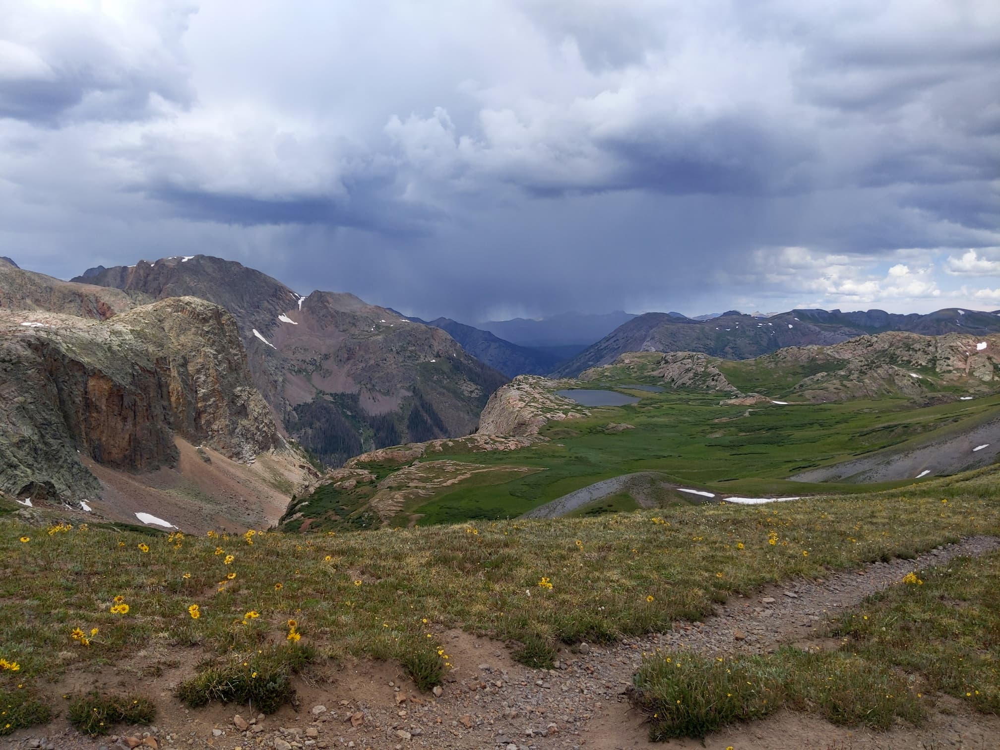

Last Sunday, July 19th, I decided to go for a long run in the Weminuche to make up for the lack of ultra marathons this year.

At about 8 AM I departed Molas Lake, heading down to the Animas River. My route took me up Elk Creek on the Colorado Trail, along the Continental Divide Trail, and finally down Vallecito Creek for a total of 36 miles!

<iframe class="strava activity" frameborder='0' allowtransparency='true' scrolling='no' src='https://www.strava.com/activities/3788347161/embed/e5c2f1df3ce2e7aaca81c61707e357842c43d2c1'></iframe>
