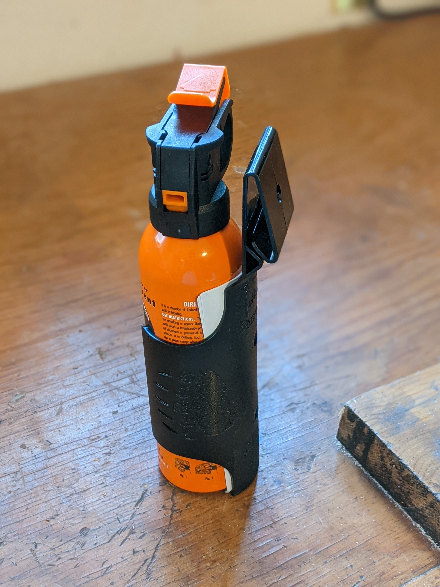
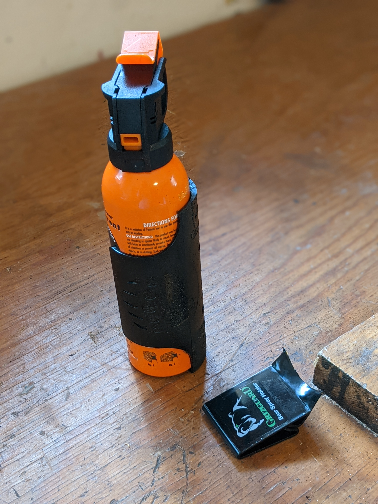
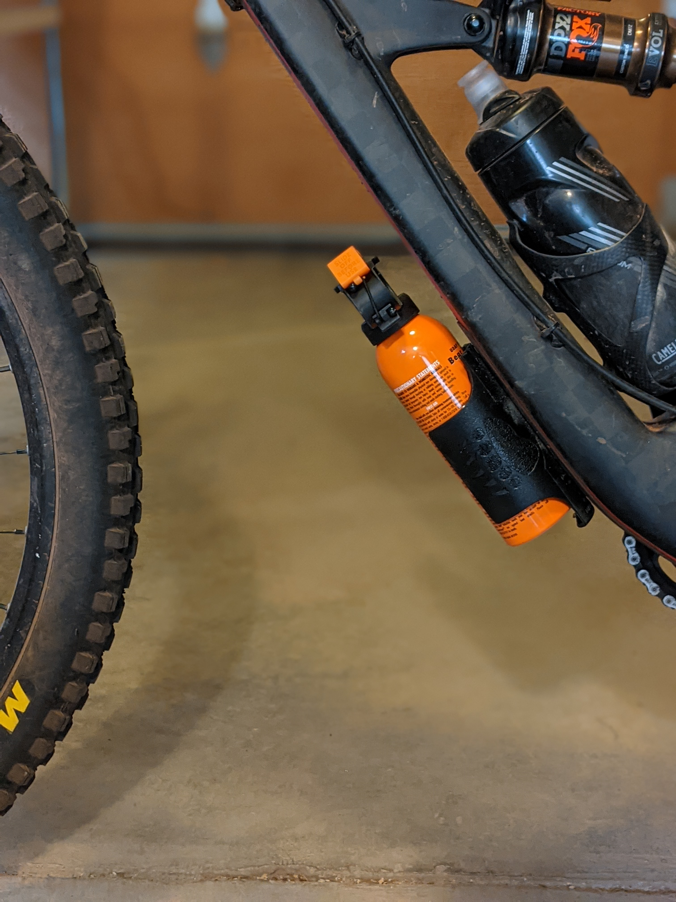

Earlier this year, [a woman was killed by a black bear](https://www.durangoherald.com/articles/durango-woman-killed-in-bear-attack-is-identified/) on a trail that my partner and I run or bike almost every day! On the day of the incident, we likely ran within a couple hundred yards of her body... needless to say we have been very careful to always carry bear spray.

## But how do I carry bear spray on my mountain bike?

When I run, it goes in my vest pocket or I carry it in my hand. The bear spray can is too small to fit in the water bottle holder... so what do I do?

1. *Buy bear spray and holder with belt attachment*

   

2. *Cut off the belt attachment*

   

3. *Drill holes matching that of my bike frame mounts*

   Sorry no photos. :(

4. *Attach the bear spray can holder to the bike frame*

   

## Does it work?

So far, I have had no issues with the mount. It hasn't fallen out, been hit by my foot, etc. Let's just hope I never need to use it!
