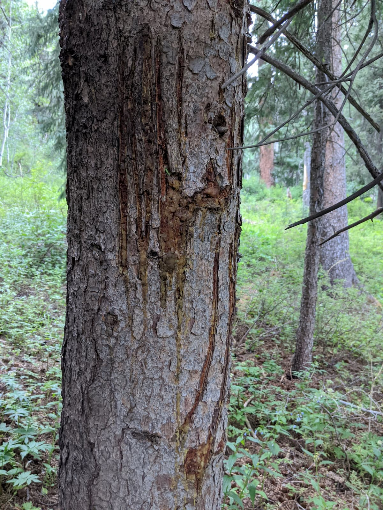

Yesterday I had one of the most frightening hikes of my life, and it happened less than a mile from my home! While hiking up an old trail along Falls Creek with my wife and three dogs, we encountered a black bear and had a very unusual interaction with it. Luckily we escaped without injury, although one of our dogs, Luna, was so frightened she ran home as fast as she could, leaving us behind and wondering if she had been injured.

## Falls Creek dog walk

It was about 7 PM on a Wednesday, the usual time for our family walk around the neighborhood. Often we stay on the private community trails, but decided that evening to head up the Falls Creek drainage to avoid the large number of people on the trails and enjoying the cooler temperatures. The Falls Creek trail is an old trail that has been mostly reclaimed by the forest with the first couple miles still passable if you don't mind a little brush to push through. It feels like many less popular trails on National Forest lands. Yesterday evening was probably my tenth time heading up the trail in the last couple months and I have always noticed a large amount of bear sign such as rocks turned over and scat. 

## Our dogs

As usual, our dogs were super excited; that is their default behavior when going on a hike or run. The three of them are certainly a handful. Luna is a fluffy mix, about 45 lbs, and 9 years old. Josie is our 30 lb, 6-8 year old mix that we call the sheriff in the group. She espeically likes to make sure Luna isn't too excited. Finally, Kora is our almost two year old, 56lb mix. She is super sweet but plays hard and rough. When going on a hike or run, it is often Josie and Kora in the lead, my wife and me, followed by Luna. Depending on the circumstances, sometimes we keep Josie in the back. She is the most likely to get in trouble, but also incredibly obedient in a heel.

## The encounter

About 0.75 miles up the trail, Josie or Kora barked about 100 feet ahead of us and over a little hill on the trail. We called them back to us and a second later we saw them sprinting down the narrow, brushy trail in our direction with a cinnamon colored black bear on their tail. It stopped just a few feet away from me. While standing my ground, yelling, and trying to look bigger than I was, the dogs and my wife moved behind me. The bear while about 8 feet away was pawing at the air, likely as frightened as we were about the situation. Unexpectedly, it ran at us again, passing alongside me on the narrow path and then heading down slope from the trail.

At this point, I hoped the bear would take the opportunity to get away, but maybe a second or two later it popped back on to the trail in front of me probably 3 to 5 feet away. Luna had also moved forward on the trail while the bear was below us and what happened next was one of the weirdest things I have seen; the bear grabbed Luna by the neck and shoulder blades with its jaws, but almost looked like it was just holding her and not trying to hurt her. It let her go almost as quickly as it grabbed her. In the meantime, I had grabbed some rocks and was trying to hit the bear with what I had. I remember having the thought that although I was close enough to kick or hit the bear, I didn't want to make physical contact. After a few more thrown rocks and with continued shouting and screaming, the bear backed up a few steps. I did the same and eventually there was enough space between us that the bear turned around. We turned and ran towards home. 

## A tramatized dog

Once we had gotten a hundred or so yards from where it happened, I stopped so that I could run my hands over Luna, expecting to find blood. There was none! We kept going and Luna ran even faster, leaving us behind. As we reached the start of the, we saw Luna far ahead of us running down the road back to our house, completely ignoring any call. She was tramatized, but without any physical injury. The only injuries seemed to be scratches on my leg and a tear of my sock, probably from the brush, but could have easily been from the bear.

## Closing thoughts

- Was the bear predatory towards our dogs? I don' think so.
- I think it was frightened by the situation and didn't know how to escape.
- I'm going to buy some [bear spray](https://amzn.to/3eWW4dX).
- Did it have cubs ahead?
- We had a similar weird injury free incident with a mountain lion in New Mexico!
- After the initial charge, I should have backed up. 

## Where it happened

<iframe class="strava" frameborder='0' allowtransparency='true' scrolling='no' src='https://www.strava.com/activities/3803740897/embed/0cc533077519485502a1d515f90ea83cee777cc0'></iframe>

## And what I will be carrying next time!

