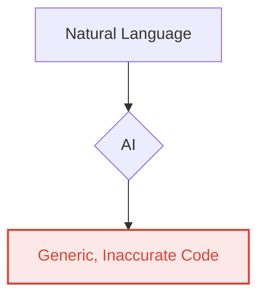
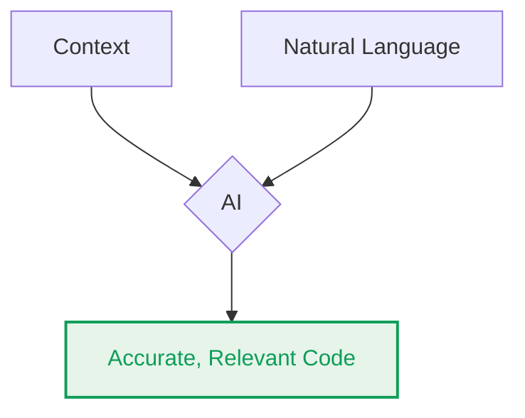

<h1>Leveraging AI Tools in Workspace Development</h1>
<Subtitle class="text-bold">October 2025</Subtitle>

<!--
Welcome everyone. Today we're going to talk about how AI is fundamentally changing the way we as developers build with Google Workspace APIs.
-->

---
svg: "none"
---

  
  

    <h2 class="text-4xl">Justin Poehnelt</h2>
    
Google Workspace Developer Relations

  

---
svg: "bottom-left"
---

# Agenda

1. Vibe Coding
1. AI Tools
1. The Context Problem
1. Orchestration
1. Key Takeaways & Next Steps

<!--
Here's our agenda. We'll start with 'vibe coding,' look at the AI tool landscape, tackle the 'context problem' with demos, touch on orchestration, and finish with key takeaways and next steps.
-->

---
svg: "none"
layout: fact
---

To move beyond basic prompts and build robust applications with AI, Workspace developers must understand and leverage the core foundations of the new AI developer tools.

<!--
My thesis driving this session is:

READ SLIDE

This get's us to the term "Vibe Coding",

How you feel about it might directly relate to my thesis here!
-->

---
layout: two-cols-header
svg: "none"
---

# Vibe Coding

Vibe coding is the art of directing AI with natural language to achieve a goal.

::left::
**Before:** Write each line of code

<<< @/snippets/vibe-coding-before.js

::right::

<v-click>

**After:** Write the goal

> "In the 'Projects' sheet, move all rows where the status in column D is 'Completed' to the 'Archive' sheet."

</v-click>

<!--
'Vibe coding' is about describing your goal in natural language, focusing on the 'what' not the 'how'.

[click]

Look at the 'before' and 'after' here. The 'before' is syntax; the 'after' is intent. This is a fundamental shift in how we code.
-->

---
svg: "none"
layout: two-cols-header
---

# Natural Language is Not Enough

::left::

Without context, AI tools can produce generic or incorrect code.

::right::

<v-click>

By providing project-specific context, the same tools can generate accurate and relevant code.

</v-click>

<!--
Relying only on natural language gives you generic, often wrong code.

[click]

When you provide project-specific context, the AI can generate accurate, relevant code. 

Hopefully!
-->

---
svg: "bottom-left"
---

# The "Gotchas" of Workspace Development

- **Mistaken Identity:** It's easy to confuse functionality in Apps Script vs API, Discovery client libraries vs gRPC client libraries vs REST HTTP calls.
- **Add-on Architectures:** Google Workspace Add-ons and Editor Add-ons have very different UI models, runtimes, and capabilities.
- **Scopes and Auth are Tricky:** Requesting the right OAuth scopes is a critical part of Workspace development, and it's fraught with nuance e.g. `@currentonly` and `drive.file`.
- **App and API Gaps:** Functionality in the application isn't always available in the API.

<!--
Workspace development has unique challenges—the 'gotchas' that can trip up even experienced developers.
-->

---
svg: "none"
---

# AI in the Mix

These same "gotchas" that challenge developers also mislead AI tools.

**An AI tool might**:

- Confidently generate code for an Editor Add-on instead of a Workspace Add-on.
- Fail to distinguish between Apps Script and JavaScript, e.g. `fetch` vs `UrlFetchApp.fetch`.
- Hallucinate a method or class or API that doesn't exist.

<v-click>

**Developers are submitting bugs about non-existent Apps Script methods!**

</v-click>

<!--
These same "gotchas" can mislead AI tools, causing them to 'hallucinate' or generate code that makes no sense.

[click]

I am even seeing this in bug reports, for example developers citing non-existent Apps Script methods and `TypeErrors`.
-->

---
svg: "bottom-left"
---

# The Empowerment Paradox

- **Lowering the Barrier:** AI empowers new developers to build powerful integrations.
- **Hidden Complexity:** But they may not understand underlying paradigms like event triggers or API quotas or algorithmic complexity.
- **The Result:** Code that _works_ but is brittle, inefficient, or has subtle, hard-to-diagnose bugs.

<!--
This leads to a paradox. While AI dramatically lowers the barrier to entry, it can also hide complexity. New developers can generate code that seems to work but is inefficient or buggy, without knowing why.

So let's take a step back and break this down.
-->

---
svg: "bottom-left"
layout: two-cols-header
---

# AI Developer Tool Landscape

::left::

- Chat Apps
- IDE Extensions
- Terminal / CLI
- GitHub App
- Asynchronous Agents

<v-click>

Many developers are missing out on the more specialized tools.
</v-click>

::right::

Many open source versions exist and can be configured with specific system instructions and models.

<QrCode text="https://codeassist.google" label="Gemini Code Assist"/>
<QrCode text="https://jules.google" label="Google Jules"/>

<!--
The AI tool landscape is broad, from chat apps to asynchronous agents.

[click]

However, many developers only use chat apps, missing out on the power of more specialized tools.

There are valid reasons for this...
- Tools are constantly changing
- And they each have a learning curve
-->

---
svg: "bottom-left"
layout: fact
---

Despite their varied interfaces, all developer tools are increasingly built on the same core foundation: **context**, **permissions**, and **orchestration**.

<!--
But with all of these tools, no matter the interface...

they basically rely on three pillars: 
- context
- permissions
- orchestration

Understanding this foundation is key.
-->

---
svg: "bottom-left"
layout: two-cols-header
---

# The Context Problem

::left::

- **No Project Context:** LLMs don't know your code, dependencies, or style guides.
- **Stale Knowledge:** An AI's knowledge is frozen in time, missing recent API or code changes.
- **Limited Memory:** The "context window" is too small for your whole project or the window becomes cluttered.

::right::
<v-click>

The solution is to ground the AI with:

- **Project-Specific Guidance** via local context files, e.g. `GEMINI.md`.
- **Live, Accurate Data** from external tools and protocols, e.g. MCP, GEMS.

</v-click>

<!--
The context problem is easy to understand.

LLMs:
- lack project knowledge
- have outdated information
- and limited memory

[click]

The solution is to ground the model with project-specific guidance and live data, giving it the awareness it lacks. 

This isn't easy.
-->

---
svg: "bottom-left"
---

# Project-Specific Guidance

Use context files (e.g., `GEMINI.md`, `AGENTS.md`) to give the AI durable, high-level instructions.

- **Define a Persona:** "You are an expert in Google Apps Script."
- **Set Conventions:** "All functions must include JSDoc comments."
- **Provide Domain Knowledge:** "A 'Lead' has a 'Status' column ('New', 'Contacted', 'Closed')."
- **Tool Instructions:** "Use `pnpm` instead of `npm` for dependency management."

<!--
Context files like `GEMINI.md` or `AGENT.md` give the AI durable, high-level instructions, defining a persona, conventions, and domain knowledge.
-->

---
svg: "none"
---

# Generating Rules Files with AI

<<< @/snippets/agents.sh
<<< @/snippets/agents.md

<!--
That may sound overwhelming, but we can use AI to generate this. 

I omitted the content and just kept the headings from the file to fit on this slide.
-->

---
svg: "bottom-left"
---

# LLMs.txt

- `llms.txt` is an index file containing links with brief descriptions of the content.
- `llms-full.txt` includes all the detailed content directly in a single file.

Google developer documentation directories include `llms.txt` and `.md.txt` files.

- `https://developers.google.com/workspace/llms.txt`
- `https://developers.google.com/workspace/calendar/.../list.md.txt`

<!--
We're generating `llms.txt` files in our documentation. They act as an index for AI tools, with `llms-full.txt` providing the complete content. You can also copy these files into your project as Markdown files.

Many libraries and frameworks provide these too!
-->

---
svg: "bottom-left"
layout: "two-cols-header"
---

# Live, Accurate Data

The solution to "Stale Knowledge" is to give the AI access to live, accurate data.

- **Grounding:** Connecting an AI to external, authoritative data sources, e.g. Google Search.
- **MCP (Model Context Protocol):** A standard, open protocol for an AI to discover and use external tools.

MCP (Model Context Protocol) is an open-source standard for connecting AI applications to external systems.

Using MCP, AI applications can connect to data sources (e.g. local files, databases), tools (e.g. search engines, calculators) and workflows (e.g. specialized prompts)—enabling them to access key information and perform tasks.

<!--
Web search is one form of grounding, but for more customized or controlled access, MCP or Model Context Protocol is the answer.
-->

---
svg: "bottom-left"
layout: "two-cols-header"
---

# Workspace Developer MCP Server

::left::
For **Workspace Developers**, the `workspace-developer.goog/mcp` server provides your AI tools with the most up-to-date Google Workspace developer documentation with two main tools:

- `search_workspace_docs`
- `fetch_workspace_docs`

Tools subject to change. More to come in the future!
::right::

<<< @/snippets/gemini-settings-mcp.jsonc

<<< @/snippets/gemini-extension.sh

<<< @/snippets/vs-code-extension.sh

<!--
We have a dedicated MCP server for Workspace developers, giving your AI tools direct access to our most current documentation.

This can be installed in multiple ways...
-->

---
svg: "none"
layout: "extent"
---

<SlidevVideo autoplay class="h-full">
  <source src="/gemini-joke-commented-out.mp4" type="video/mp4" />
  

    Your browser does not support videos. You may download it
    <a href="/gemini-joke-commented-out.mp4">here</a>.
  

</SlidevVideo>

<!--
Here is the gemini-cli in action!

First I ask gemini to tell a joke about Apps Script:

Why did the Apps Script function break up with the infinite loop.

Because it couldn't handle a commitment longer than 6 minutes.

Then I ask again but tell it to use the MCP docs tools.

Why do Apps Script developers have trust issues?

Because even their commented out code asks for permissions.

The context for this joke isn't new, but it is deep in the developer documentation.
-->

---
svg: "bottom-left"
---

# The Double-Edged Sword

Adding more tools and context seems like the obvious solution, but it can backfire.

- **Analysis Paralysis:** Too many tools or options can confuse the AI, leading to inefficient or incorrect tool selection.
- **Garbage In, Garbage Out:** If the context you provide (your documentation, your code) is outdated or flawed, the AI's output will be too.
- **Instruction Overload:** An AI might ignore or misinterpret your instructions, especially with a cluttered context window.

<!--
But be warned: more context isn't always better. Too many tools can lead to 'analysis paralysis,' and flawed context means flawed output.

Orchestration helps to address many of these challenges.
-->

---
svg: "none"
layout: two-cols-header
---

# Orchestration

The automated coordination of multiple tools and AI models to achieve a complex goal, often handled by an **agent**.

::left::

- **Task Decomposition:** Breaks large requests into manageable sub-tasks.
- **Context Management:** Selectively loads necessary context for each step, overcoming context limitations.
- **Tool Chaining:** Uses the output of one tool as the input for another.

::right::

- **Memory:** Maintains short and long-term memory to preserve state.
- **Delegation:** Can assign work to specialized sub-agents (e.g., a "testing agent" or a "refactoring agent").

<!--
Orchestration is like an automated project manager. An agent breaks down large requests, manages context for each step, and chains tools together.

Many tools do this implicitly while others allow you to configure the sub-agents with different tools, personas, and more.

Jules from Google is an example of an asynchronous orchestration agent.
-->

---
svg: "none"
layout: "extent"
---

<SlidevVideo autoplay class="h-full">
  <source src="/jules.mp4" type="video/mp4" />
  

    Your browser does not support videos. You may download it
    <a href="/jules.mp4">here</a>.
  

</SlidevVideo>

<!--
(video autoplays)
-->

---
svg: "bottom-left"
layout: "two-cols-header"
---

# Google Jules

Jules is an AI software engineer that can help you with your development tasks.

::left::

- **Autonomous:** Jules can work independently to solve problems.
- **Resourceful:** Jules can use tools to interact with your codebase and external resources.
- **Collaborative:** Jules can work with you to understand your needs and get feedback.

::right::

<QrCode text="https://jules.google" label="Google Jules"/>

<!--
Here is the slide generated by Jules.
(I'm not using Google Slides for this presentation)
-->

---
svg: "none"
layout: "extent"
---

<!--
Here you can see the UI for Jules and the full workflow to creating a PR.

(pause a few seconds for audience to read slide)
-->

---
svg: "none"
---

<ScaleToFit></ScaleToFit>

<!--
And of course Gemini Code Assist reviewed the pull request!

(pause a few seconds for audience to read slide)
-->

---
svg: "none"
layout: "fact"
---

## Keeping up with these tools is **EXHAUSTING**!

<!--
Keeping up is exhausting! The field is moving incredibly fast, but the fundamental principles are stable.
-->

---
svg: "bottom-left"
layout: "two-cols-header"
---

# Use Cases, Benchmarks, and "Vibes"

Each use case may require a different AI tool and a unique combination of **context**, **permissions**, and **orchestration**.

- Explain or summarize code
- Find and fix bugs
- Write unit tests
- Build a complete application from scratch

**The only way to know is to experiment and try!**

<!--
Different use cases require different tools. There's no one-size-fits-all solution, so experiment to find what works for you.
-->

---
svg: "bottom-left"
---

# Workspace Tips

- Build abstractions over the Workspace APIs specific to your application.
- Use concrete goals, iterate on X until Y.
- Use rule files to differentiate implementation patterns. Link to the specific documentation in your rule file.
- Ask the AI to verify its implementation.

  `gemini -i "verify this code with the 'search_workspace_docs' tool"`

- Know the limits, iterate with AI as a pair programmer.

<!--
Here are a Workspace tips: build abstractions over our APIs, set concrete goals for AI prompts, use rule files, and ask the AI to verify its own work.
-->

---
svg: "bottom-left"
---

# Key Takeaways

- **Embrace "Vibe Coding":** Shift your focus from writing code to describing intent.
- **Understand the Core Foundations:** Ground AI with **context**, manage **permissions**, and use **orchestration**.
- **Evaluate, Evaluate, Vibes(?):** Systematically test and benchmark different AI tools or find what works for you!
- **Leverage Purpose-Built Tools:** Adopt the coding specific AI tools, move beyond the Chat Apps. Give these tools more specific tools for your problem area.

<!--
To recap: embrace 'vibe coding,' understand context, permissions, and orchestration, experiment to find what works, and leverage purpose-built tools.
-->

---
svg: "bottom-left"
layout: two-cols-header
---

# Next Steps and Questions

::left::

- **Explore the tools:** [Gemini Code Assist](https://cloud.google.com/gemini/code-assist), [Jules](https://jules.google) and [Gemini CLI](https://github.com/google-gemini/gemini-cli)
- **Install Workspace Developer Tools**
  - MCP Server
  - Gemini CLI Extension (+MCP Server)
  - VS Code Extension (+MCP Server)

::right::

<<< @/snippets/gemini-settings-mcp.jsonc

<<< @/snippets/gemini-extension.sh

<<< @/snippets/vs-code-extension.sh

<!--
For next steps, explore Gemini Code Assist and the Gemini CLI, check out our developer documentation, and install the MCP server to start experimenting.
-->

---
svg: "none"
layout: center
---

<QrCode text="https://talks.jpoehnelt.dev/2025-google-workspace-leveraging-ai-in-development/1" label="Session Slides" class="mr-10"/>
    <QrCode text="https://developers.google.com/workspace/guides/build-with-llms#mcp" label="MCP Instructions"/>
    <QrCode text="https://github.com/googleworkspace/developer-tools" label="Gemini CLI Extension"/>
    <QrCode text="https://marketplace.visualstudio.com/items?itemName=google-workspace.google-workspace-developer-tools" label="VS Code Extension"/>

---
svg: "none"
---

 
