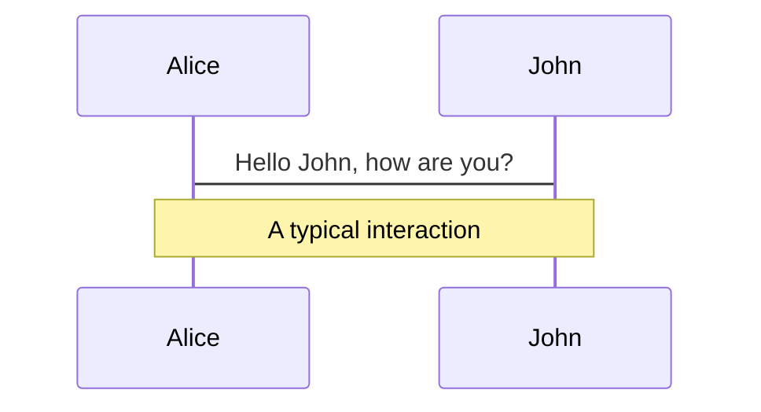
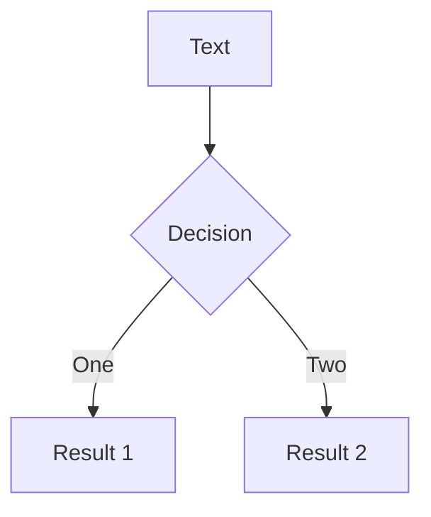
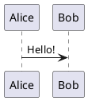

# Addon Gallery

Browse awesome addons available for Slidev here.

Read more about to use them, and to create your own addon.

## Official Addons

## Community Addons

Here are the curated addons made by the community.

## More Addons

Find all the [addons available on NPM](https://www.npmjs.com/search?q=keywords%3Aslidev-addon).

---

---

## url: /guide/animations.md

# Animation

Animation is an essential part of slide presentations. Slidev provides a variety of ways to animate your slides, from the simple to the complex. This guide will show you how to use them effectively.

## Click Animation {#click-animation}

A "**click**" can be considered as the unit of animation steps in slides. A slide can have one or more clicks, and each click can trigger one or more animations - for example, revealing or hiding elements.

> \[!NOTE]
> Since v0.48.0, we've rewritten the click animations system with much more consistent behaviors. It might change the behaviors of your existing slides in edge cases. While this page is showing the new click system, you can find more details about the refactor in [#1279](https://github.com/slidevjs/slidev/pull/1279).

### `v-click` {#v-click}

To apply show/hide "click animations" for elements, you can use the `<v-click>` component or the `v-click` directive.

```md
<!-- Component usage:
     this will be invisible until you press "next" -->

<v-click> Hello World! </v-click>

<!-- Directive usage:
     this will be invisible until you press "next" the second time -->
<div v-click class="text-xl"> Hey! </div>
```

### `v-after` {#v-after}

`v-after` will turn the element visible when the previous `v-click` is triggered.

```md
<div v-click> Hello </div>
<div v-after> World </div>  <!-- or <v-after> World </v-after> -->
```

When you press "next", both `Hello` and `World` will show up together.

### Hide after clicking {#hide-after-clicking}

Add a `.hide` modifier to `v-click` or `v-after` directives to make elements invisible after clicking, instead of showing up.

```md
<div v-click> Visible after 1 click </div>
<div v-click.hide> Hidden after 2 clicks </div>
<div v-after.hide> Hidden after 2 clicks </div>
```

For the components, you can use the `hide` prop to achieve the same effect:

```md
<v-click> Visible after 1 click </v-click>
<v-click hide> Hidden after 2 clicks </v-click>
<v-after hide> Also hidden after 2 clicks </v-after>
```

### `v-clicks` {#v-clicks}

`v-clicks` is only provided as a component. It's a shorthand to apply the `v-click` directive to all its child elements. It is especially useful when working with lists and tables.

```md
<v-clicks>

- Item 1
- Item 2
- Item 3

</v-clicks>
```

An item will become visible each time you click "next".
It accepts a `depth` prop for nested list:

```md
<v-clicks depth="2">

- Item 1
  - Item 1.1
  - Item 1.2
- Item 2
  - Item 2.1
  - Item 2.2

</v-clicks>
```

Also, you can use the `every` prop to specify the number of items to show after each click:

```md
<v-clicks every="2">

- Item 1.1
- Item 1.2
- Item 2.1
- Item 2.2

</v-clicks>
```

### Positioning {#positioning}

By default, the clicking animations are triggered one by one. You can customize the animation "position" of elements by using the `at` prop or the `v-click` directive with value.

Like the CSS layout system, click-animated elements can be "relative" or "absolute":

#### Relative Position {#relative-position}

This actual position of relative elements is calculated based on the previous relative elements:

````md
<div v-click> visible after 1 click </div>
<v-click at="+2"><div> visible after 3 clicks </div></v-click>
<div v-click.hide="'-1'"> hidden after 2 clicks </div>

```js {none|1|2}{at:'+5'}
1; // highlighted after 7 clicks
2; // highlighted after 8 clicks
```
````

> \[!NOTE]
> The default value of `v-click` is `'+1'` when you don't specify it.

In fact, `v-after` are just shortcuts for `v-click` with `at` prop:

```md
<!-- The following 2 usages are equivalent -->


<!-- The following 3 usages are equivalent -->


<v-click-gap size="1" />
```

::: tip `at` prop value format
Only string values starting with `'+'` or `'-'` like `'+1'` are treated as relative positions:

| Value          | Kind     |
| -------------- | -------- |
| `'-1'`, `'+1'` | Relative |
| `+1` === `1`   | Absolute |
| `'1'`          | Absolute |

So don't forget the single quotes for the relative values.
:::

#### Absolute Position {#absolute-position}

The given value is the exact click count to trigger this animation:

````md
<div v-click="3"> visible after 3 clicks </div>
<v-click at="2"><div> visible after 2 clicks </div></v-click>
<div v-click.hide="1"> hidden after 1 click </div>

```js {none|1|2}{at:3}
1; // highlighted after 3 clicks
2; // highlighted after 4 clicks
```
````

#### Mixed Case {#mixed-case}

You can mix the absolute and relative positions:

```md
<div v-click> visible after 1 click </div>
<div v-click="3"> visible after 3 clicks </div>
<div v-click> visible after 2 click </div>
<div v-click="'-1'"> visible after 1 click </div>
<div v-click="4"> visible after 4 clicks </div>
```

The following example synchronizes the highlighting of the two code blocks:

````md {1,6}
```js {1|2}{at:1}
1 + 1;
"a" + "b";
```

```js {1|2}{at:1}
= 2
= 'ab'
```
````

### Enter & Leave {#enter-leave}

You can also specify the enter and leave index for the `v-click` directive by passing an array. The end index is exclusive.

```md
<div v-click.hide="[2, 4]">
  This will be hidden at click 2 and 3 (and shown otherwise).
</div>
<div v-click />
<div v-click="['+1', '+1']">
  This will be shown only at click 2 (and hidden otherwise).
</div>
```

You can also use `v-switch` to achieve the same effect:

```md
<v-switch>
  <template #1> show at click 1, hide at click 2. </template>
  <template #2> show at click 2, hide at click 5. </template>
  <template #5-7> show at click 5, hide at click 7. </template>
</v-switch>
```

See [`VSwitch` Component](/builtin/components#vswitch) for more details.

### Custom Total Clicks Count {#total}

By default, Slidev automatically calculates how many clicks are required before going to the next slide. You can override this via the `clicks` frontmatter option:

```yaml
---
# 10 clicks in this slide, before going to the next slide
clicks: 10
---
```

### Element Transitions {#element-transitions}

When you apply the `v-click` directive to your elements, it will attach the class name `slidev-vclick-target` to it. When the elements are hidden, the class name `slidev-vclick-hidden` will also be attached. For example:

```html
<div class="slidev-vclick-target slidev-vclick-hidden">Text</div>
```

After a click, it may become:

```html
<div class="slidev-vclick-target">Text</div>
```

By default, a subtle opacity transition is applied to those classes:

```css
/* below shows the default style */

.slidev-vclick-target {
  transition: opacity 100ms ease;
}

.slidev-vclick-hidden {
  opacity: 0;
  pointer-events: none;
}
```

You can override them to customize the transition effects in your custom stylesheets. For example, you can achieve the scaling up transitions by:

```css
/* styles.css */

.slidev-vclick-target {
  transition: all 500ms ease;
}

.slidev-vclick-hidden {
  transform: scale(0);
}
```

To specify animations for only certain slides or layouts:

```scss
.slidev-page-7,
.slidev-layout.my-custom-layout {
  .slidev-vclick-target {
    transition: all 500ms ease;
  }

  .slidev-vclick-hidden {
    transform: scale(0);
  }
}
```

Learn more about [customizing styles](/custom/directory-structure#style).

## Motion {#motion}

Slidev has [@vueuse/motion](https://motion.vueuse.org/) built-in. You can use the `v-motion` directive to any elements to apply motion to them. For example

```html
<div v-motion :initial="{ x: -80 }" :enter="{ x: 0 }" :leave="{ x: 80 }">
  Slidev
</div>
```

The text `Slidev` will move from `-80px` to its original position when entering the slide. When leaving, it will move to `80px`.

> Before v0.48.9, you need to add `preload: false` to the slide's frontmatter to enable motion.

### Motion with Clicks {#motion-with-clicks}

> Available since v0.48.9

You can also trigger the motion by clicks:

```html
<div
  v-motion
  :initial="{ x: -80 }"
  :enter="{ x: 0, y: 0 }"
  :click-1="{ x: 0, y: 30 }"
  :click-2="{ y: 60 }"
  :click-2-4="{ x: 40 }"
  :leave="{ y: 0, x: 80 }"
>
  Slidev
</div>
```

Or combine `v-click` with `v-motion`:

```html
<div
  v-click="[2, 4]"
  v-motion
  :initial="{ x: -50 }"
  :enter="{ x: 0 }"
  :leave="{ x: 50 }"
>
  Shown at click 2 and hidden at click 4.
</div>
```

The meanings of variants:

- `initial`: When `currentPage < thisPage`, or `v-click` hides the current element because `$clicks` is too small.
- `enter`: When `currentPage === thisPage`, and `v-click` shows the element. _Priority: lowest_
- `click-x`: `x` is a number representing the **absolute** click num. The variant will take effect if `$clicks >= x`. _Priority: `x`_
- `click-x-y`: The variant will take effect if `x <= $clicks < y`. _Priority: `x`_
- `leave`: `currentPage > thisPage`, or `v-click` hides the current element because `$clicks` is too large.

The variants will be combined according to the priority defined above.

::: warning
Due to a Vue internal [bug](https://github.com/vuejs/core/issues/10295), currently **only** `v-click` applied to the same element as `v-motion` can control the motion animation. As a workaround, you can use something like `v-if="3 < $clicks"` to achieve the same effect.
:::

Learn more: [Demo](https://sli.dev/demo/starter/10) | [@vueuse/motion](https://motion.vueuse.org/) | [v-motion](https://motion.vueuse.org/features/directive-usage) | [Presets](https://motion.vueuse.org/features/presets)

## Slide Transitions {#slide-transitions}

Slidev supports slide transitions out of the box. You can enable it by setting the `transition` frontmatter option:

```md
---
transition: slide-left
---
```

This will give you a nice sliding effects on slide switching. Setting it in the headmatter will apply this to all slides. You can also set different transitions per slide in frontmatters.

### Builtin Transitions {#builtin-transitions}

- `fade` - Crossfade in/out
- `fade-out` - Fade out and then fade in
- `slide-left` - Slides to the left (slide to right when going backward)
- `slide-right` - Slides to the right (slide to left when going backward)
- `slide-up` - Slides to the top (slide to bottom when going backward)
- `slide-down` - Slides to the bottom (slide to top when going backward)
- `view-transition` - Via the view transitions API

### View Transition API {#view-transitions}

The View Transitions API provides a mechanism for easily creating animated transitions between different DOM states. Learn more about it in [View Transitions API - MDN Web Docs](https://developer.mozilla.org/en-US/docs/Web/API/View_Transitions_API).

:::warning
Experimental: This is not supported by all browsers. Check the [Browser compatibility table](https://developer.mozilla.org/en-US/docs/Web/API/View_Transitions_API#browser_compatibility) carefully before using this.
:::

You can use the `view-transition-name` CSS property to name view transitions, which creates connections between different page elements and smooth transitions when switching slides.

You can enable [MDC (Markdown Component) Syntax](/guide/syntax#mdc-syntax) support to conveniently name view-transitions:

```md
---
transition: view-transition
mdc: true
---

# View Transition {.inline-block.view-transition-title}

---

# View Transition {.inline-block.view-transition-title}
```

### Custom Transitions {#custom-transitions}

Slidev's slide transitions are powered by [Vue Transition](https://vuejs.org/guide/built-ins/transition.html). You can provide your custom transitions by:

```md
---
transition: my-transition
---
```

and then in your custom stylesheets:

```css
.my-transition-enter-active,
.my-transition-leave-active {
  transition: opacity 0.5s ease;
}

.my-transition-enter-from,
.my-transition-leave-to {
  opacity: 0;
}
```

Learn more about how it works in [Vue Transition](https://vuejs.org/guide/built-ins/transition.html).

### Forward & Backward Transitions {#forward-backward-transitions}

You can specify different transitions for forward and backward navigation using `|` as a separator in the transition name:

```md
---
transition: go-forward | go-backward
---
```

With this, when you go from slide 1 to slide 2, the `go-forward` transition will be applied. When you go from slide 2 to slide 1, the `go-backward` transition will be applied.

### Advanced Usage {#advanced-usage}

The `transition` field accepts an option that will passed to the [`<TransitionGroup>`](https://vuejs.org/api/built-in-components.html#transition) component. For example:

```md
---
transition:
  name: my-transition
  enterFromClass: custom-enter-from
  enterActiveClass: custom-enter-active
---
```

---

---

url: /features/block-frontmatter.md
description: |
Use a YAML code block as the frontmatter.

---

# Block Frontmatter

The usual way to define frontmatters of slides is concise, but may lack of highlighting and formatter support. To solve this, you can use a YAML block at the very beginning of the slide content as the frontmatter of the slide:

````md
---
theme: default
---

# Slide 1

---

```yaml
layout: quote
```

# Slide 2

---

# Slide 3
````

::: warning About headmatter

Headmatter in Slidev is exactly the usual called "frontmatter" of the a Markdown file, which is supported by most of the Markdown editors and formatters. So you can't use a YAML block as the headmatter of the whole slide deck.

:::

---

---

## url: /guide/hosting.md

# Building and Hosting

Slidev is designed to run as a web server when you are editing or presenting your slides. However, after the presentation, you may still want to share your **interactive** slides with others. This guide will show you how to build and host your slides.

## Build as a SPA {#spa}

You can build the slides into a static [Single-page application (SPA)](https://developer.mozilla.org/en-US/docs/Glossary/SPA) via the following command:

```bash
$ slidev build
```

By default, the generated files are placed in the `dist` folder. You can test the built version of you slides by running: `npx vite preview` or any other static server.

### Base Path {#base}

To deploy your slides under sub-routes, you need to pass the `--base` option. The `--base` path **must begin and end with a slash `/`**. For example:

```bash
$ slidev build --base /talks/my-cool-talk/
```

Refer to [Vite's documentation](https://vitejs.dev/guide/build.html#public-base-path) for more details.

### Output directory {#output-directory}

You can change the output directory using `--out`.

```bash
$ slidev build --out my-build-folder
```

### Multiple Builds {#multiple-builds}

You can build multiple slide decks in one go by passing multiple markdown files as arguments:

```bash
$ slidev build slides1.md slides2.md
```

Or if your shell supports it, you can use a glob pattern:

```bash
$ slidev build *.md
```

In this case, each input file will generate a folder containing the build in the output directory.

### Examples {#examples}

Here are a few examples of the exported SPA:

- [Demo Slides](https://sli.dev/demo/starter)
- [Composable Vue](https://talks.antfu.me/2021/composable-vue) by [Anthony Fu](https://github.com/antfu)
- More in [Showcases](../resources/showcases)

### Options {#options}

## Hosting {#hosting}

We recommend using `npm init slidev@latest` to scaffold your project, which contains the necessary configuration files for hosting services out-of-the-box.

### GitHub Pages {#github-pages}

To deploy your slides on [GitHub Pages](https://pages.github.com/) via GitHub Actions, follow these steps:

1. In your repository, go to `Settings` > `Pages`. Under `Build and deployment`, select `GitHub Actions`. (Do not choose `Deploy from a branch` and upload the `dist` directory, which is not recommended.)
2. Create `.github/workflows/deploy.yml` with the following content to deploy your slides to GitHub Pages via GitHub Actions.

::: details deploy.yml

```yaml
name: Deploy pages

on:
  workflow_dispatch:
  push:
    branches: [main]

permissions:
  contents: read
  pages: write
  id-token: write

concurrency:
  group: pages
  cancel-in-progress: false

jobs:
  build:
    runs-on: ubuntu-latest

    steps:
      - uses: actions/checkout@v4

      - uses: actions/setup-node@v4
        with:
          node-version: "lts/*"

      - name: Setup @antfu/ni
        run: npm i -g @antfu/ni

      - name: Install dependencies
        run: nci

      - name: Build
        run: nr build --base /${{github.event.repository.name}}/

      - name: Setup Pages
        uses: actions/configure-pages@v4

      - uses: actions/upload-pages-artifact@v3
        with:
          path: dist

  deploy:
    environment:
      name: github-pages
      url: ${{ steps.deployment.outputs.page_url }}
    needs: build
    runs-on: ubuntu-latest
    name: Deploy
    steps:
      - name: Deploy to GitHub Pages
        id: deployment
        uses: actions/deploy-pages@v4
```

:::

3. Commit and push the changes to your repository. The GitHub Actions workflow will automatically deploy your slides to GitHub Pages every time you push to the `main` branch.
4. You can access your slides at `https://<username>.github.io/<repository-name>/`.

### Netlify

Create `netlify.toml` in your project root with the following content:

::: details netlify.toml

```toml
[build]
publish = 'dist'
command = 'npm run build'

[build.environment]
NODE_VERSION = '20'

[[redirects]]
from = '/*'
to = '/index.html'
status = 200
```

:::

Then go to your [Netlify dashboard](https://netlify.com/) and create a new site with the repository.

### Vercel

Create `vercel.json` in your project root with the following content:

::: details vercel.json

```json
{
  "rewrites": [{ "source": "/(.*)", "destination": "/index.html" }]
}
```

:::

Then go to your [Vercel dashboard](https://vercel.com/) and create a new site with the repository.

### Host on Docker {#docker}

If you need a rapid way to run a presentation with containers, you can use the prebuilt [docker image](https://hub.docker.com/r/tangramor/slidev) maintained by [tangramor](https://github.com/tangramor), or build your own.

::: details Use the Docker Image

Just run the following command in your work folder:

```bash
docker run --name slidev --rm -it \
    --user node \
    -v ${PWD}:/slidev \
    -p 3030:3030 \
    -e NPM_MIRROR="https://registry.npmmirror.com" \
    tangramor/slidev:latest
```

**_Note_**: You can use `NPM_MIRROR` to specify a npm mirror to speed up the installation process.

If your work folder is empty, it will generate a template `slides.md` and other related files under your work folder, and launch the server on port `3030`.

You can access your slides from `http://localhost:3030/`

To create an Docker Image for your slides, you can use the following Dockerfile:

```Dockerfile
FROM tangramor/slidev:latest

ADD . /slidev
```

Create the docker image: `docker build -t myslides .`

And run the container: `docker run --name myslides --rm --user node -p 3030:3030 myslides`

You can visit your slides at `http://localhost:3030/`

:::

---

---

url: /features/bundle-remote-assets.md
description: |
Download and bundle remote assets when building your slides.

---

# Bundle Remote Assets

Just like you would do in markdown, you can use images pointing to a remote or local URL.

For remote assets, the built-in [`vite-plugin-remote-assets`](https://github.com/antfu/vite-plugin-remote-assets) will cache them onto the disk at first run, ensuring instant loading even for large images later on.

```md

```

For local assets, put them into the [`public` folder](/custom/directory-structure.html#public) and reference them with a **leading slash** (i.e., `/pic.png`, NOT `./pic.png`, which is relative to the working file).

```md

```

If you want to apply custom sizes or styles, you can convert them to the `` tag:

```html

```

---

---

url: /features/click-marker.md
description: |
Highlighting notes and auto-scrolling to the active section of notes.

---

# Click Markers

For some slides you may have longer notes that could be hard to find your place. Slidev supports click markers that allow highlighting and auto-scrolling to the section of notes from your corresponding content. Put `[click]` markers at the beginning of any line in your notes for the timing you need to go to another [click](/guide/animations#click-animation). You may skip `n` clicks by using `[click:{n+1}]`. For example:

```md
<!--
Content before the first click

[click] This will be highlighted after the first click

Also highlighted after the first click

- [click] This list element will be highlighted after the second click

[click:3] Last click (skip two clicks)
-->
```

Slidev divides the content between the click markers and highlights it in presenter notes, synchronized with your slide progress.

---

---

url: /features/code-groups.md
description: |
Group multiple code blocks and automatically match icon by the title name.

---

# Code Groups

> \[!NOTE]
> This feature requires [MDC Syntax](/features/mdc#mdc-syntax). Enable `mdc: true` to use it.

You can group multiple code blocks like this:

````md
::code-group

```sh [npm]
npm i @slidev/cli
```

```sh [yarn]
yarn add @slidev/cli
```

```sh [pnpm]
pnpm add @slidev/cli
```

::
````

## Title Icon Matching

`code groups`, `code block` and [`Shiki Magic Move`](/features/shiki-magic-move) also supports the automatically icon matching by the title name.


::: info

By default, we provide some built-in icons, you can use them by install [@iconify-json/vscode-icons](https://www.npmjs.com/package/@iconify-json/vscode-icons).

:::

::: details All built-in icons

```js
const builtinIcons = {
  // package managers
  pnpm: "i-vscode-icons:file-type-light-pnpm",
  npm: "i-vscode-icons:file-type-npm",
  yarn: "i-vscode-icons:file-type-yarn",
  bun: "i-vscode-icons:file-type-bun",
  deno: "i-vscode-icons:file-type-deno",
  // frameworks
  vue: "i-vscode-icons:file-type-vue",
  svelte: "i-vscode-icons:file-type-svelte",
  angular: "i-vscode-icons:file-type-angular",
  react: "i-vscode-icons:file-type-reactjs",
  next: "i-vscode-icons:file-type-light-next",
  nuxt: "i-vscode-icons:file-type-nuxt",
  solid: "logos:solidjs-icon",
  astro: "i-vscode-icons:file-type-light-astro",
  // bundlers
  rollup: "i-vscode-icons:file-type-rollup",
  webpack: "i-vscode-icons:file-type-webpack",
  vite: "i-vscode-icons:file-type-vite",
  esbuild: "i-vscode-icons:file-type-esbuild",
  // configuration files
  "package.json": "i-vscode-icons:file-type-node",
  "tsconfig.json": "i-vscode-icons:file-type-tsconfig",
  ".npmrc": "i-vscode-icons:file-type-npm",
  ".editorconfig": "i-vscode-icons:file-type-editorconfig",
  ".eslintrc": "i-vscode-icons:file-type-eslint",
  ".eslintignore": "i-vscode-icons:file-type-eslint",
  "eslint.config": "i-vscode-icons:file-type-eslint",
  ".gitignore": "i-vscode-icons:file-type-git",
  ".gitattributes": "i-vscode-icons:file-type-git",
  ".env": "i-vscode-icons:file-type-dotenv",
  ".env.example": "i-vscode-icons:file-type-dotenv",
  ".vscode": "i-vscode-icons:file-type-vscode",
  "tailwind.config": "vscode-icons:file-type-tailwind",
  "uno.config": "i-vscode-icons:file-type-unocss",
  "unocss.config": "i-vscode-icons:file-type-unocss",
  ".oxlintrc": "i-vscode-icons:file-type-oxlint",
  "vue.config": "i-vscode-icons:file-type-vueconfig",
  // filename extensions
  ".mts": "i-vscode-icons:file-type-typescript",
  ".cts": "i-vscode-icons:file-type-typescript",
  ".ts": "i-vscode-icons:file-type-typescript",
  ".tsx": "i-vscode-icons:file-type-typescript",
  ".mjs": "i-vscode-icons:file-type-js",
  ".cjs": "i-vscode-icons:file-type-js",
  ".json": "i-vscode-icons:file-type-json",
  ".js": "i-vscode-icons:file-type-js",
  ".jsx": "i-vscode-icons:file-type-js",
  ".md": "i-vscode-icons:file-type-markdown",
  ".py": "i-vscode-icons:file-type-python",
  ".ico": "i-vscode-icons:file-type-favicon",
  ".html": "i-vscode-icons:file-type-html",
  ".css": "i-vscode-icons:file-type-css",
  ".scss": "i-vscode-icons:file-type-scss",
  ".yml": "i-vscode-icons:file-type-light-yaml",
  ".yaml": "i-vscode-icons:file-type-light-yaml",
  ".php": "i-vscode-icons:file-type-php",
};
```

:::

## Custom Icons

You can use any name from the [iconify](https://icones.js.org) collection by using the `~icon~` syntax, for example:

````md
```js [npm ~i-uil:github~]
console.log("Hello, GitHub!");
```
````

To make it work, you need to:

1. Install the icon's collection.

:::code-group

```sh [npm]
npm add @iconify-json/uil
```

```sh [yarn]
yarn add @iconify-json/uil
```

```sh [pnpm]
pnpm add @iconify-json/uil
```

```sh [bun]
bun add @iconify-json/uil
```

:::

2. Add the icon to the `uno.config.ts` file.

```ts [uno.config.ts] {4-6}
import { defineConfig } from "unocss";

export default defineConfig({
  safelist: ["i-uil:github"],
});
```

---

---

## url: /builtin/components.md

# Components

This page lists all the built-in components provided by Slidev. These components can be **directly** used in your slides.

Note that can provide additional components. To add your own components, see .

## `Arrow`

Draw an arrow.

### Usage

```md
<Arrow x1="10" y1="20" x2="100" y2="200" />
```

Or:

```md
<Arrow v-bind="{ x1:10, y1:10, x2:200, y2:200 }" />
```

Props:

- `x1` (`string | number`, required): start point x position
- `y1` (`string | number`, required): start point y position
- `x2` (`string | number`, required): end point x position
- `y2` (`string | number`, required): end point y position
- `width` (`string | number`, default: `2`): line width
- `color` (`string`, default: `'currentColor'`): line color
- `two-way` (`boolean`, default: `false`): draw a two-way arrow

## `VDragArrow`

An `Arrow` component that can be dragged.

### Usage

Props not related to position are the same as [the `Arrow` component](#arrow).

## `AutoFitText`

> Experimental

Box inside which the font size will automatically adapt to fit the content. Similar to PowerPoint or Keynote TextBox.

### Usage

```md
<AutoFitText :max="200" :min="100" modelValue="Some text"/>
```

Props:

- `max` (`string | number`, default `100`): Maximum font size
- `min` (`string | number`, default `30`): Minimum font size
- `modelValue` (`string`, default `''`): text content

## `LightOrDark`

Use it to display one thing or another depending on the active light or dark theme.

### Usage

Use it with the two named Slots `#dark` and `#light`:

```md
<LightOrDark>
  <template #dark>Dark mode is on</template>
  <template #light>Light mode is on</template>
</LightOrDark>
```

Provided props on `LightOrDark` component will be available using scoped slot props:

```md
<LightOrDark width="100" alt="some image">
  <template #dark="props">
    
  </template>
  <template #light="props">
    
  </template>
</LightOrDark>
```

You can provide markdown in the slots, but you will need to surround the content with blank lines:

```md
<LightOrDark>
  <template #dark>


  </template>
  <template #light>


  </template>
</LightOrDark>
```

## `Link`

Insert a link you can use to navigate to a given slide.

### Usage

```md
<Link to="42">Go to slide 42</Link>
<Link to="42" title="Go to slide 42"/>
<Link to="solutions" title="Go to solutions"/>
```

Props:

- `to` (`string | number`): The path of the slide to navigate to (slides path starts from `1`)
- `title` (`string`): The title to display

One can use a string as `to`, provided the corresponding route exists, e.g.

```md
---
routeAlias: solutions
---

# Now some solutions!
```

## `PoweredBySlidev`

Renders "Powered by Slidev" with a link to the Slidev website.

## `RenderWhen`

Render slots depend on whether the context matches (for example whether we are in presenter view).

### Usage

```md
<RenderWhen context="presenter">This will only be rendered in presenter view.</RenderWhen>
```

Context type: `'main' | 'visible' | 'print' | 'slide' | 'overview' | 'presenter' | 'previewNext'`

Props:

- `context` (`Context | Context[]`): a context or array of contexts you want to check for
  - `'main'`: Render in slides and presenter view (equivalent to \['slide', 'presenter']),
  - `'visible'`: Render the content if it is visible
  - `'print'`: Render in print mode
  - `'slide'`: Render in slides
  - `'overview'`: Render in overview
  - `'presenter'`: Render in presenter view
  - `'previewNext'`: Render in presenter's next slide view

Slots:

- `#default`: Rendered when the context matches
- `#fallback`: Rendered when the context does not match

## `SlideCurrentNo`

Current slide number.

### Usage

```md
<SlideCurrentNo />
```

## `SlidesTotal`

Total number of slides.

### Usage

```md
<SlidesTotal />
```

## `TitleRenderer`

Insert the main title from a slide parsed as HTML.

Titles and title levels get automatically retrieved from the first title element of each slide.

You can override this automatic behavior for a slide by using the front matter syntax:

```yml
---
title: Amazing slide title
level: 2
---
```

### Usage

The `<TitleRenderer>` component is a virtual component you can import with:

```js
import TitleRenderer from "#slidev/title-renderer";
```

Then you can use it with:

```md
<TitleRenderer no="42" />
```

Props:

- `no` (`string | number`): The number of the slide to display the title from (slides starts from `1`)

## `Toc`

Insert a Table Of Content.

If you want a slide to not appear in the `<Toc>` component, you can use the `hideInToc` option in the frontmatter of the slide:

```yml
---
hideInToc: true
---
```

Titles are displayed using the [`<Titles>` component](#titles)

### Usage

```md
<Toc />
```

Props:

- `columns` (`string | number`, default: `1`): The number of columns of the display
- `listClass` (`string | string[]`, default: `''`): Classes to apply to the table of contents list
- `maxDepth` (`string | number`, default: `Infinity`): The maximum depth level of title to display
- `minDepth` (`string | number`, default: `1`): The minimum depth level of title to display
- `mode` (`'all' | 'onlyCurrentTree'| 'onlySiblings'`, default: `'all'`):
  - `'all'`: Display all items
  - `'onlyCurrentTree'`: Display only items that are in current tree (active item, parents and children of active item)
  - `'onlySiblings'`: Display only items that are in current tree and their direct siblings

## `Transform`

Apply scaling or transforming to elements.

### Usage

```md
<Transform :scale="0.5" origin="top center">
  <YourElements />
</Transform>
```

Props:

- `scale` (`number | string`, default `1`): transform scale value
- `origin` (`string`, default `'top left'`): transform origin value

## `Tweet`

Embed a tweet.

### Usage

```md
<Tweet id="20" />
```

Props:

- `id` (`number | string`, required): id of the tweet
- `scale` (`number | string`, default `1`): transform scale value
- `conversation` (`string`, default `'none'`): [tweet embed parameter](https://developer.twitter.com/en/docs/twitter-for-websites/embedded-tweets/guides/embedded-tweet-parameter-reference)
- `cards` (`'hidden' | 'visible'`, default `'visible'`): [tweet embed parameter](https://developer.twitter.com/en/docs/twitter-for-websites/embedded-tweets/guides/embedded-tweet-parameter-reference)

## `VAfter`, `VClick` and `VClicks`

## `VSwitch`

Switch between multiple slots based on clicks.

- If the `unmount` prop is set to `true`, the previous slot will be unmounted when switching to the next slot. Default is `false`.
- Use the `tag` and `childTag` props to change the default tag of the component and its children. Default is `div`.
- Use the `transition` prop to change the transition effect. Default is `false` (disabled).

## `VDrag`

## `SlidevVideo`

Embed a video.

### Usage

```md
<SlidevVideo v-click autoplay controls>
  <!-- Anything that can go in an HTML video element. -->
  <source src="/myMovie.mp4" type="video/mp4" />
  <source src="/myMovie.webm" type="video/webm" />
  <p>
    Your browser does not support videos. You may download it
    <a href="/myMovie.mp4">here</a>.
  </p>
</SlidevVideo>
```

Check [HTML video element's doc](https://developer.mozilla.org/docs/Web/HTML/Element/Video) to see what can be included in this component's slot.

Props:

- `controls` (`boolean`, default: `false`): show the video controls
- `autoplay` (`boolean | 'once'`, default: `false`):
  - `true` or `'once'`: start the video only once and does not restart it once ended or paused
  - `false`: never automatically start the video (rely on `controls` instead)
- `autoreset` (`'slide' | 'click'`, default: `undefined`):
  - `'slide'`: go back to the start of the video when going back to the slide
  - `'click'`: go back to the start of the video when going back to the component's click turn
- `poster` (`string | undefined`, default: `undefined`):
  - The source of the image to print when the video is not playing.
- `printPoster` (`string | undefined`, default: `undefined`):
  - The override for `poster` when printing.
- `timestamp` (`string | number`, default: `0`):
  - The starting time of the video in seconds.
- `printTimestamp` (`string | number | 'last' | undefined`, default: `undefined`):
  - The override for `timestamp` when printing.

::: warning
When exporting, the video may fail to load because Chromium does not support some video formats. In this case, you can specify the executable path of the browser. See [Chromium executable path](/guide/exporting.html#executable-path) for more information.
:::

## `Youtube`

Embed a YouTube video.

### Usage

```md
<Youtube id="luoMHjh-XcQ" />
```

Props:

- `id` (`string`, required): id of the YouTube video
- `width` (`number`): width of the video
- `height` (`number`): height of the video

You can also make the video start at a specific time if you add `?start=1234` to the id value (where `1234` is seconds),

---

---

## url: /guide/component.md

# Components in Slides

One of the most powerful features of Slidev is the ability to use Vue components directly in your slides. This allows you to create interactive and dynamic content with ease.

## Using Components {#use}

With the help of [`unplugin-vue-components`](https://github.com/unplugin/unplugin-vue-components), Slidev allows you to use Vue components directly in your slides without importing them manually:

```md
# My Slide

<MyComponent :count="4"/>
```

The components come from:

- Built-in components. See [Built-in Components](../builtin/components) for reference.
- Provided by the theme and addons. See .
- Custom components in the `components` directory. See the next section.

## Writing Components {#write}

To create a custom component, simply create a new Vue file in the `components` directory:

```bash
your-slidev/
  ├── ...
  ├── slides.md
  └── components/
      ├── ...
      └── MyComponent.vue
```

Refer to the [Vue documentation](https://vuejs.org/guide/essentials/component-basics.html) for how to write Vue components.

You can also to reuse and share your components with others.

---

---

## url: /custom/config-code-runners.md

# Configure Code Runners

Define code runners for custom languages in your Monaco Editor.

By default, JavaScript, TypeScript runners are supported built-in. They run in the browser **without** a sandbox environment. If you want more advanced integrations, you can provide your own code runner that sends the code to a remote server, runs in a Web Worker, or anything, up to you.

Create `./setup/code-runners.ts` with the following content:

```ts twoslash [setup/code-runners.ts]
declare const executePythonCodeRemotely: (code: string) => Promise<string>;
declare const sanitizeHtml: (html: string) => string;
// ---cut---
import { defineCodeRunnersSetup } from "@slidev/types";

export default defineCodeRunnersSetup(() => {
  return {
    async python(code, ctx) {
      // Somehow execute the code and return the result
      const result = await executePythonCodeRemotely(code);
      return {
        text: result,
      };
    },
    html(code, ctx) {
      return {
        html: sanitizeHtml(code),
      };
    },
    // or other languages, key is the language id
  };
});
```

## Runner Context

The second argument `ctx` is the runner context, which contains the following properties:

```ts twoslash
import type { CodeRunnerOutputs } from "@slidev/types";
import type { CodeToHastOptions } from "shiki";
// ---cut---
export interface CodeRunnerContext {
  /**
   * Options passed to runner via the `runnerOptions` prop.
   */
  options: Record<string, unknown>;
  /**
   * Highlight code with shiki.
   */
  highlight: (
    code: string,
    lang: string,
    options?: Partial<CodeToHastOptions>,
  ) => string;
  /**
   * Use (other) code runner to run code.
   */
  run: (code: string, lang: string) => Promise<CodeRunnerOutputs>;
}
```

## Runner Output

The runner can either return a text or HTML output, or an element to be mounted. Refer to https://github.com/slidevjs/slidev/blob/main/packages/types/src/code-runner.ts for more details.

## Additional Runner Dependencies

By default, Slidev will scan the Markdown source and automatically import the necessary dependencies for the code runners. If you want to manually import dependencies, you can use the `monacoRunAdditionalDeps` option in the slide frontmatter:

```yaml
monacoRunAdditionalDeps:
  - ./path/to/dependency
  - lodash-es
```

::: tip
The paths are resolved relative to the `snippets` directory. And the names of the deps should be exactly the same as the imported ones in the code.
:::

---

---

## url: /custom/config-context-menu.md

# Configure Context Menu

Customize the context menu items in Slidev.

Create `./setup/context-menu.ts` with the following content:

```ts twoslash [./setup/context-menu.ts]
// ---cut---
import { useNav } from "@slidev/client";
import { defineContextMenuSetup } from "@slidev/types";
import { computed } from "vue";
// ---cut-start---
// @ts-expect-error missing types
// ---cut-end---
import Icon3DCursor from "~icons/carbon/3d-cursor";

export default defineContextMenuSetup((items) => {
  const { isPresenter } = useNav();
  return computed(() => [
    ...items.value,
    {
      small: false,
      icon: Icon3DCursor, // if `small` is `true`, only the icon is shown
      label: "Custom Menu Item", // or a Vue component
      action() {
        alert("Custom Menu Item Clicked!");
      },
      disabled: isPresenter.value,
    },
  ]);
});
```

This will append a new menu item to the context menu.

To disable context menu globally, set `contextMenu` to `false` in the frontmatter. `contextMenu` can also be set to `dev` or `build` to only enable the context menu in development or build mode.

---

---

## url: /custom/config-fonts.md

# Configure Fonts

While you can use HTML and CSS to customize the fonts and style for your slides as you want, Slidev also provides a convenient way to use them effortlessly.

In your frontmatter, configure as the following:

```yaml
---
fonts:
  # basically the text
  sans: Robot
  # use with `font-serif` css class from UnoCSS
  serif: Robot Slab
  # for code blocks, inline code, etc.
  mono: Fira Code
---
```

And that's all.

Fonts will be **imported automatically from a provider via CDN, by default it is [Google Fonts](https://fonts.google.com/)**. That means you can use any fonts available on Google Fonts directly.

## Local Fonts

By default, Slidev assumes all the fonts specified via `fonts` configurations come from Google Fonts. If you want to use local fonts, specify the `fonts.local` to opt-out the auto-importing.

```yaml
---
fonts:
  # like font-family in css, you can use `,` to separate multiple fonts for fallback
  sans: "Helvetica Neue,Robot"
  # mark 'Helvetica Neue' as local font
  local: Helvetica Neue
---
```

## Weights & Italic

By default, Slidev imports three weights `200`,`400`,`600` for each font. You can configure them by:

```yaml
---
fonts:
  sans: Robot
  # default
  weights: "200,400,600"
  # import italic fonts, default `false`
  italic: false
---
```

This configuration applies to all web fonts. For more fine-grained controls of each font's weights, you will need to manually import them with [HTML](/custom/directory-structure.html#index-html) and CSS.

## Fallback Fonts

For most of the scenarios, you only need to specify the "special font" and Slidev will append the fallback fonts for you, for example:

```yaml
---
fonts:
  sans: Robot
  serif: Robot Slab
  mono: Fira Code
---
```

will result in

```css
.font-sans {
  font-family:
    "Robot",
    ui-sans-serif,
    system-ui,
    -apple-system,
    BlinkMacSystemFont,
    "Segoe UI",
    Roboto,
    "Helvetica Neue",
    Arial,
    "Noto Sans",
    sans-serif,
    "Apple Color Emoji",
    "Segoe UI Emoji",
    "Segoe UI Symbol",
    "Noto Color Emoji";
}
.font-serif {
  font-family:
    "Robot Slab", ui-serif, Georgia, Cambria, "Times New Roman", Times, serif;
}
.font-mono {
  font-family:
    "Fira Code", ui-monospace, SFMono-Regular, Menlo, Monaco, Consolas,
    "Liberation Mono", "Courier New", monospace;
}
```

If you want to disable the fallback fonts, configure as the following:

```yaml
---
fonts:
  mono: "Fira Code, monospace"
  fallbacks: false
---
```

## Providers

- Options: `google` | `coollabs` | `none`
- Default: `google`

Currently, only [Google Fonts](https://fonts.google.com/) and [coolLabs](https://fonts.coollabs.io/) supported, we are planning to add more providers in the future. Specify to `none` will disable the auto-importing feature entirely and treat all the fonts locally.

```yaml
---
fonts:
  provider: none
---
```

---

---

## url: /custom/config-highlighter.md

# Configure Highlighter

Slidev uses [Shiki](https://github.com/shikijs/shiki) as the code highlighter. It's a TextMate Grammar powered syntax highlighter as accurate as VS Code. It generates colored tokens so no additinal CSS is required. Shiki also comes with [a bunch of built-in themes](https://shiki.style/themes). In Slidev, we also provided the [TwoSlash](#twoslash-integration) support.

## Configure Shiki

Create `./setup/shiki.ts` file with the following content:

```ts twoslash [setup/shiki.ts]
import { defineShikiSetup } from "@slidev/types";

export default defineShikiSetup(() => {
  return {
    themes: {
      dark: "min-dark",
      light: "min-light",
    },
    transformers: [
      // ...
    ],
  };
});
```

If you want to add custom theme or language (TextMate grammar/themes in JSON), you can import them in the setup file:

```ts twoslash [setup/shiki.ts]
import { defineShikiSetup } from "@slidev/types";
// ---cut-start---
// @ts-expect-error missing types
// ---cut-end---
import customLanguage from "./customLanguage.tmLanguage.json";
// ---cut-start---
// @ts-expect-error missing types
// ---cut-end---
import customTheme from "./customTheme.tmTheme.json";

export default defineShikiSetup(() => {
  return {
    themes: {
      dark: customTheme,
      light: "min-light",
    },
    langs: [
      "js",
      "typescript",
      "cpp",
      customLanguage,
      // ...
    ],
    transformers: [
      // ...
    ],
  };
});
```

Check [Built-in languages](https://shiki.style/languages) and [Built-in themes](https://shiki.style/themes), and refer to [Shiki's docs](https://shiki.style) for more details.

:::info
For now, Shiki Magic Move does not support transformers.
:::

## Configure Prism

:::warning
Prism support has been removed since v0.50. Please use Shiki instead.
:::

---

---

## url: /custom/config-katex.md

# Configure KaTeX

Create `./setup/katex.ts` with the following content:

```ts twoslash [setup/katex.ts]
import { defineKatexSetup } from "@slidev/types";

export default defineKatexSetup(() => {
  return {
    maxExpand: 2000,
    /* ... */
  };
});
```

The return value should be the custom options for KaTeX. Refer to [KaTeX's documentation](https://katex.org/docs/options.html) or the type definition for the full options list.

---

---

## url: /custom/config-mermaid.md

# Configure Mermaid

Create `./setup/mermaid.ts` with the following content:

```ts twoslash [setup/mermaid.ts]
import { defineMermaidSetup } from "@slidev/types";

export default defineMermaidSetup(() => {
  return {
    theme: "forest",
  };
});
```

The return value should be the custom configs for [Mermaid](https://mermaid.js.org/). Refer to the [Mermaid documentation](https://mermaid.js.org/config/schema-docs/config.html) or the type definition for the full config list.

## Custom theme/styles

In case you want to create your custom Mermaid themes or styles, you can do this by defining `themeVariables` like in the following example:

```ts twoslash
import { defineMermaidSetup } from "@slidev/types";

export default defineMermaidSetup(() => {
  return {
    theme: "base",
    themeVariables: {
      // General theme variables
      noteBkgColor: "#181d29",
      noteTextColor: "#F3EFF5cc",
      noteBorderColor: "#404551",

      // Sequence diagram variables
      actorBkg: "#0E131F",
      actorBorder: "#44FFD2",
      actorTextColor: "#F3EFF5",
      actorLineColor: "#F3EFF5",
      signalColor: "#F3EFF5",
      signalTextColor: "#F3EFF5",
    },
  };
});
```

You can find all theme variables on the [Mermaid Theme Configuration](https://mermaid.js.org/config/theming.html) page.

---

---

## url: /custom/config-monaco.md

# Configure Monaco

Create `./setup/monaco.ts` with the following content:

```ts twoslash [./setup/monaco.ts]
import { defineMonacoSetup } from "@slidev/types";

export default defineMonacoSetup(async (monaco) => {
  // use `monaco` to configure
});
```

Learn more about [configuring Monaco](https://github.com/Microsoft/monaco-editor).

## TypeScript Types

When using TypeScript with Monaco, types for dependencies will be installed to the client-side automatically.

````md
```ts {monaco}
import { ref } from "vue";
import { useMouse } from "@vueuse/core";

const counter = ref(0);
```
````

In the example above, make sure `vue` and `@vueuse/core` are installed locally as dependencies / devDependencies, Slidev will handle the rest to get the types working for the editor automatically. When deployed as SPA, those types will also be bundled for static hosting.

### Additional Types

Slidev will scan all the Monaco code blocks in your slides and import the types for those used libraries for you. In case it missed some, you can explicitly specify extra packages to import the types for:

```md
---
monacoTypesAdditionalPackages:
  - lodash-es
  - foo
---
```

### Auto Type Acquisition

You can optionally switch to load types from CDN by setting the following headmatter:

```md
---
monacoTypesSource: ata
---
```

This feature is powered by [`@typescript/ata`](https://github.com/microsoft/TypeScript-Website/tree/v2/packages/ata) and runs completely on the client-side.

## Configure Themes

Since v0.48.0, Monaco will reuse the Shiki theme you configured in [Shiki's setup file](/custom/config-highlighter#configure-shiki), powered by [`@shikijs/monaco`](https://shiki.style/packages/monaco). You don't need to worry about it anymore and it will have a consistent style with the rest of your code blocks.

## Configure the Editor

> Available since v0.43.0

If you would like to customize the Monaco editor you may pass an `editorOptions` object that matches the [Monaco IEditorOptions](https://microsoft.github.io/monaco-editor/docs.html#interfaces/editor.IEditorOptions.html) definition.

````md
```ts {monaco} { editorOptions: { wordWrap:'on'} }
console.log("HelloWorld");
```
````

Alternatively if you would like these options to be applied to every Monaco instance, you can return them in the `defineMonacoSetup` function

```ts twoslash [./setup/monaco.ts]
import { defineMonacoSetup } from "@slidev/types";

export default defineMonacoSetup(() => {
  return {
    editorOptions: {
      wordWrap: "on",
    },
  };
});
```

## Disabling

Since v0.48.0, the Monaco editor is enabled by default and only be bundled when you use it. If you want to disable it, you can set `monaco` to `false` in the frontmatter of your slide:

```yaml
---
monaco: false # can also be `dev` or `build` to conditionally enable it
---
```

## Configure Code Runners

To configure how the Monaco Runner runs the code, or to add support for custom languages, please reference [Configure Code Runners](/custom/config-code-runners).

---

---

## url: /custom/config-parser.md

# Configure Pre-Parser

::: info
Custom pre-parsers are not supposed to be used too often. Usually you can use [Transformers](./config-transformers) for custom syntaxes.
:::

Slidev parses your presentation file (e.g. `slides.md`) in three steps:

1. A "preparsing" step is carried out: the file is split into slides using the `---` separator, and considering the possible frontmatter blocks.
2. Each slide is parsed with an external library.
3. Slidev resolves the special frontmatter property `src: ....`, which allows to include other md files.

## Markdown Parser

Configuring the markdown parser used in step 2 can be done by [configuring Vite internal plugins](/custom/config-vite#configure-internal-plugins).

## Preparser Extensions

> Available since v0.37.0.

::: warning
Important: when modifying the preparser configuration, you need to stop and start Slidev again (restart might not be sufficient).
:::

The preparser (step 1 above) is highly extensible and allows you to implement custom syntaxes for your md files. Extending the preparser is considered **an advanced feature** and is susceptible to breaking [editor integrations](../features/side-editor) due to implicit changes in the syntax.

To customize it, create a `./setup/preparser.ts` file with the following content:

```ts twoslash [./setup/preparser.ts]
import { definePreparserSetup } from "@slidev/types";

export default definePreparserSetup(({ filepath, headmatter, mode }) => {
  return [
    {
      transformRawLines(lines) {
        for (const i in lines) {
          if (lines[i] === "@@@") lines[i] = "HELLO";
        }
      },
    },
  ];
});
```

This example systematically replaces any `@@@` line with a line with `hello`. It illustrates the structure of a preparser configuration file and some of the main concepts the preparser involves:

- `definePreparserSetup` must be called with a function as parameter.
- The function receives the file path (of the root presentation file), the headmatter (from the md file) and, since v0.48.0, a mode (dev, build or export). It could use this information (e.g., enable extensions based on the presentation file or whether we are exporting a PDF).
- The function must return a list of preparser extensions.
- An extension can contain:
  - a `transformRawLines(lines)` function that runs just after parsing the headmatter of the md file and receives a list of all lines (from the md file). The function can mutate the list arbitrarily.
  - a `transformSlide(content, frontmatter)` function that is called for each slide, just after splitting the file, and receives the slide content as a string and the frontmatter of the slide as an object. The function can mutate the frontmatter and must return the content string (possibly modified, possibly `undefined` if no modifications have been done).
  - a `transformNote(note, frontmatter)` function that is called for each slide, just after splitting the file, and receives the slide note as a string or undefined and the frontmatter of the slide as an object. The function can mutate the frontmatter and must return the note string (possibly modified, possibly `undefined` if no modifications have been done).
  - a `name`

## Example Preparser Extensions

### Use case 1: compact syntax top-level presentation

Imagine a situation where (part of) your presentation is mainly showing cover images and including other md files. You might want a compact notation where for instance (part of) `slides.md` is as follows:

```md
@cover: /nice.jpg

# Welcome

@src: page1.md
@src: page2.md
@cover: /break.jpg
@src: pages3-4.md
@cover: https://cover.sli.dev

# Questions?

see you next time
```

To allow these `@src:` and `@cover:` syntaxes, create a `./setup/preparser.ts` file with the following content:

```ts twoslash [./setup/preparser.ts]
import { definePreparserSetup } from "@slidev/types";

export default definePreparserSetup(() => {
  return [
    {
      transformRawLines(lines) {
        let i = 0;
        while (i < lines.length) {
          const l = lines[i];
          if (l.match(/^@cover:/i)) {
            lines.splice(
              i,
              1,
              "---",
              "layout: cover",
              `background: ${l.replace(/^@cover: */i, "")}`,
              "---",
              "",
            );
            continue;
          }
          if (l.match(/^@src:/i)) {
            lines.splice(
              i,
              1,
              "---",
              `src: ${l.replace(/^@src: */i, "")}`,
              "---",
              "",
            );
            continue;
          }
          i++;
        }
      },
    },
  ];
});
```

And that's it.

### Use case 2: using custom frontmatter to wrap slides

Imagine a case where you often want to scale some of your slides but still want to use a variety of existing layouts so creating a new layout would not be suited.
For instance, you might want to write your `slides.md` as follows:

```md
---
layout: quote
_scale: 0.75
---

# Welcome

> great!

---

## \_scale: 4

# Break

---

# Ok

---

layout: center
\_scale: 2.5

---

# Questions?

see you next time
```

Here we used an underscore in `_scale` to avoid possible conflicts with existing frontmatter properties (indeed, the case of `scale`, without underscore would cause potential problems).

To handle this `_scale: ...` syntax in the frontmatter, create a `./setup/preparser.ts` file with the following content:

```ts twoslash [./setup/preparser.ts]
import { definePreparserSetup } from "@slidev/types";

export default definePreparserSetup(() => {
  return [
    {
      async transformSlide(content, frontmatter) {
        if ("_scale" in frontmatter) {
          return [
            `<Transform :scale=${frontmatter._scale}>`,
            "",
            content,
            "",
            "</Transform>",
          ].join("\n");
        }
      },
    },
  ];
});
```

And that's it.

### Use case 3: using custom frontmatter to transform note

Imagine a case where you want to replace the slides default notes with custom notes.
For instance, you might want to write your `slides.md` as follows:

```md
---
layout: quote
_note: notes/note.md
---

# Welcome

> great!

<!--
Default slide notes
-->
```

Here we used an underscore in `_note` to avoid possible conflicts with existing frontmatter properties.

To handle this `_note: ...` syntax in the frontmatter, create a `./setup/preparser.ts` file with the following content:

```ts twoslash [./setup/preparser.ts]
import fs, { promises as fsp } from "node:fs";
import { definePreparserSetup } from "@slidev/types";

export default definePreparserSetup(() => {
  return [
    {
      async transformNote(note, frontmatter) {
        if ("_note" in frontmatter && fs.existsSync(frontmatter._note)) {
          try {
            const newNote = await fsp.readFile(frontmatter._note, "utf8");
            return newNote;
          } catch (err) {}
        }

        return note;
      },
    },
  ];
});
```

---

---

## url: /custom/config-routes.md

# Configure Routes

Add custom pages to the Slidev app.

## Usage

Create `./setup/routes.ts` with the following content:

```ts twoslash [./setup/routes.ts]
import { defineRoutesSetup } from "@slidev/types";

export default defineRoutesSetup((routes) => {
  return [
    ...routes,
    {
      path: "/my-page",
      // ---cut-start---
      // @ts-expect-error missing types
      // ---cut-end---
      component: () => import("../pages/my-page.vue"),
    },
  ];
});
```

Learn more about routes in the [Vue Router documentation](https://router.vuejs.org/).

---

---

## url: /custom/config-shortcuts.md

# Configure Shortcuts

## Getting started

Create `./setup/shortcuts.ts` with the following content:

```ts twoslash [./setup/shortcuts.ts]
import type { NavOperations, ShortcutOptions } from "@slidev/types";
import { defineShortcutsSetup } from "@slidev/types";

export default defineShortcutsSetup(
  (nav: NavOperations, base: ShortcutOptions[]) => {
    return [
      ...base, // keep the existing shortcuts
      {
        key: "enter",
        fn: () => nav.next(),
        autoRepeat: true,
      },
      {
        key: "backspace",
        fn: () => nav.prev(),
        autoRepeat: true,
      },
    ];
  },
);
```

In the setup function, you can customize the keyboard shortcuts by returning a new array of shortcuts. The above example binds the `next` operation to enter and the `prev` operation to backspace.

Please refer to [Navigation Actions](../guide/ui#navigation-actions) section for the default shortcuts and navigation operations.

## Key Binding Format

The `key` of each shortcut can be either a string (e.g. `'Shift+Ctrl+A'`) or a computed boolean. Please refer to [`useMagicKeys` from VueUse](https://vueuse.org/core/useMagicKeys/) for

---

---

## url: /custom/config-transformers.md

# Configure Transformers

This setup function allows you to define custom transformers for the markdown content of **each slide**. This is useful when you want to add custom Markdown syntax and render custom code blocks. To start, create a `./setup/transformers.ts` file with the following content:

````ts twoslash [setup/transformers.ts]
import type { MarkdownTransformContext } from "@slidev/types";
import { defineTransformersSetup } from "@slidev/types";

function myCodeblock(ctx: MarkdownTransformContext) {
  console.log("index in presentation", ctx.slide.index);
  ctx.s.replace(
    /^```myblock *(\{[^\n]*\})?\n([\s\S]+?)\n```/gm,
    (full, options = "", code = "") => {
      return `...`;
    },
  );
}

export default defineTransformersSetup(() => {
  return {
    pre: [],
    preCodeblock: [myCodeblock],
    postCodeblock: [],
    post: [],
  };
});
````

The return value should be the custom options for the transformers. The `pre`, `preCodeblock`, `postCodeblock`, and `post` are arrays of functions that will be called in order to transform the markdown content. The order of the transformers is:

1. `pre` from your project
2. `pre` from addons and themes
3. Import snippets syntax and Shiki magic move
4. `preCodeblock` from your project
5. `preCodeblock` from addons and themes
6. Built-in special code blocks like Mermaid, Monaco and PlantUML
7. `postCodeblock` from addons and themes
8. `postCodeblock` from your project
9. Other built-in transformers like code block wrapping
10. `post` from addons and themes
11. `post` from your project

---

---

## url: /custom/config-unocss.md

# Configure UnoCSS

[UnoCSS](https://unocss.dev) is now the default CSS framework for Slidev since v0.42.0. UnoCSS is a fast atomic CSS engine that has full flexibility and extensibility. Most of the Tailwind CSS classes are supported **out-of-box**, and you can also extend it with your own configurations.

By default, Slidev enables the following presets out-of-box:

- [@unocss/preset-wind3](https://unocss.dev/presets/wind3) - Tailwind / Windi CSS compatible utilities
- [@unocss/preset-attributify](https://unocss.dev/presets/attributify) - Attributify mode
- [@unocss/preset-icons](https://unocss.dev/presets/icons) - Use any icons as class
- [@unocss/preset-web-fonts](https://unocss.dev/presets/web-fonts) - Use web fonts at ease
- [@unocss/transformer-directives](https://unocss.dev/transformers/directives) - Use `@apply` in CSS

Slidev also adds shortcuts as can be seen in its [source code](https://github.com/slidevjs/slidev/blob/main/packages/client/uno.config.ts).

You can therefore style your content the way you want. For example:

```html
<div class="grid pt-4 gap-4 grid-cols-[100px,1fr]">
  ### Name - Item 1 - Item 2
</div>
```

## Configurations

You can create `uno.config.ts` under the root of your project to extend the builtin configurations

```ts twoslash [uno.config.ts]
import { defineConfig } from "unocss";

export default defineConfig({
  shortcuts: {
    // custom the default background
    "bg-main": "bg-white text-[#181818] dark:(bg-[#121212] text-[#ddd])",
  },
  // ...
});
```

Learn more about [UnoCSS configurations](https://unocss.dev/guide/config-file)

---

---

## url: /custom/config-vite.md

# Configure Vite and Plugins

Slidev is powered by [Vite](https://vitejs.dev/) under the hood. This means you can leverage Vite's great plugin system to customize your slides even further.

The `vite.config.ts` will be respected if you have one, and will be merged with the Vite config provided by Slidev, your theme and the addons.

## Configure Internal Plugins

Slidev internally adds the following plugins to Vite:

- [@vitejs/plugin-vue](https://github.com/vitejs/vite-plugin-vue)
- [unplugin-vue-components](https://github.com/unplugin/unplugin-vue-components)
- [unplugin-icons](https://github.com/unplugin/unplugin-icons)
- [vite-plugin-vue-markdown](https://github.com/unplugin/unplugin-vue-markdown)
- [vite-plugin-remote-assets](https://github.com/antfu/vite-plugin-remote-assets)
- [unocss/vite](https://github.com/unocss/unocss/tree/main/packages/vite)

To configure the built-in plugins listed above, create a `vite.config.ts` with the following content. Please note that Slidev has some [default configurations](https://github.com/slidevjs/slidev/blob/main/packages/slidev/node/vite/index.ts) for those plugins, this usage will override some of them, which may potentially cause the app to break. Please treat this as **an advanced feature**, and make sure you know what you are doing before moving on.

```ts twoslash [vite.config.ts]
/// <reference types="@slidev/types" />
import type MarkdownIt from "markdown-it";

declare const MyPlugin: (md: any) => void;
// ---cut---
import { defineConfig } from "vite";

export default defineConfig({
  slidev: {
    vue: {
      /* vue options */
    },
    markdown: {
      /* markdown-it options */
      markdownItSetup(md) {
        /* custom markdown-it plugins */
        md.use(MyPlugin);
      },
    },
    /* options for other plugins */
  },
});
```

See the [type declarations](https://github.com/slidevjs/slidev/blob/main/packages/types/src/vite.ts#L11) for more options.

::: warning
It is not allowed to re-add plugins that has been used internally be Slidev. For example, instead of

```ts twoslash
import Vue from "@vitejs/plugin-vue";
import { defineConfig } from "vite";

export default defineConfig({
  plugins: [
    Vue({
      /* vue options */
    }),
  ],
});
```

Please pass the Vue options to the `slidev.vue` field as described above
:::

## Add Custom Plugins based on Slide data

Usually you can add Vite plugins into your `vite.config.ts` (see above).
However, if you want to add plugins based on the slide data, you need to add a `./setup/vite-plugins.ts` with the following content:

```ts twoslash
import { defineVitePluginsSetup } from "@slidev/types";

export default defineVitePluginsSetup((options) => {
  return [
    // Your plugins here
    // Slide data is available as options.data.slides
  ];
});
```

---

---

## url: /custom/config-vue.md

# Configure Vue App

Slidev uses [Vue 3](https://v3.vuejs.org/) to render the application on the client side. You can extend the app to add custom plugins or configurations.

Create `./setup/main.ts` with the following content:

```ts twoslash [setup/main.ts]
import type { Plugin } from "vue";

declare const YourPlugin: Plugin;
// ---cut---
import { defineAppSetup } from "@slidev/types";

export default defineAppSetup(({ app, router }) => {
  // Vue App
  app.use(YourPlugin);
});
```

This can also be used as the main entrance of your Slidev app to do some initializations before the app starts.

Learn more: [Vue Application API](https://v3.vuejs.org/api/application-api.html#component).

---

---

## url: /resources/covers.md

# Curated Covers

We curated a few cover images to demonstrate our starter template.


```yaml
---
# random image from the curated collection
background: https://cover.sli.dev
---
```

If you enjoy any of them, check out our [Unsplash collection](https://unsplash.com/collections/94734566/slidev) and find out their authors.

[cover.sli.dev](https://cover.sli.dev) is hosted from [`slidevjs/slidev-covers`](https://github.com/slidevjs/slidev-covers).

---

---

## url: /custom.md

# Customizations

Slidev is fully customizable, from styling to tooling configurations. It allows you to configure the tools underneath ([Vite](/custom/config-vite), [UnoCSS](/custom/config-unocss), [Monaco](/custom/config-monaco), etc.)

## Slides Deck Configs {#headmatter}

You can configure the whole slides project in the frontmatter of your **first** slide (i.e. headmatter). The following shows the default value for each option:

```yaml
---
# theme id, package name, or local path
# Learn more: https://sli.dev/guide/theme-addon.html#use-theme
theme: default
# addons, can be a list of package names or local paths
# Learn more: https://sli.dev/guide/theme-addon.html#use-addon
addons: []
# title of your slide, will inferred from the first header if not specified
title: Slidev
# titleTemplate for the webpage, `%s` will be replaced by the slides deck's title
titleTemplate: "%s - Slidev"
# information for your slides, can be a Markdown string
info: false
# author field for exported PDF or PPTX
author: Your Name Here
# keywords field for exported PDF, comma-delimited
keywords: keyword1,keyword2

# enable presenter mode, can be boolean, 'dev' or 'build'
presenter: true
# enable browser exporter, can be boolean, 'dev' or 'build'
browserExporter: dev
# enabled pdf downloading in SPA build, can also be a custom url
download: false
# filename of the export file
exportFilename: slidev-exported
# export options
# use export CLI options in camelCase format
# Learn more: https://sli.dev/guide/exporting.html
export:
  format: pdf
  timeout: 30000
  dark: false
  withClicks: false
  withToc: false
# enable twoslash, can be boolean, 'dev' or 'build'
twoslash: true
# show line numbers in code blocks
lineNumbers: false
# enable monaco editor, can be boolean, 'dev' or 'build'
monaco: true
# Where to load monaco types from, can be 'cdn', 'local' or 'none'
monacoTypesSource: local
# explicitly specify extra local packages to import the types for
monacoTypesAdditionalPackages: []
# explicitly specify extra local modules as dependencies of monaco runnable
monacoRunAdditionalDeps: []
# download remote assets in local using vite-plugin-remote-assets, can be boolean, 'dev' or 'build'
remoteAssets: false
# controls whether texts in slides are selectable
selectable: true
# enable slide recording, can be boolean, 'dev' or 'build'
record: dev
# enable Slidev's context menu, can be boolean, 'dev' or 'build'
contextMenu: true
# enable wake lock, can be boolean, 'dev' or 'build'
wakeLock: true
# take snapshot for each slide in the overview
overviewSnapshots: false

# force color schema for the slides, can be 'auto', 'light', or 'dark'
colorSchema: auto
# router mode for vue-router, can be "history" or "hash"
routerMode: history
# aspect ratio for the slides
aspectRatio: 16/9
# real width of the canvas, unit in px
canvasWidth: 980
# used for theme customization, will inject root styles as `--slidev-theme-x` for attribute `x`
themeConfig:
  primary: "#5d8392"

# favicon, can be a local file path or URL
favicon: "https://cdn.jsdelivr.net/gh/slidevjs/slidev/assets/favicon.png"
# URL of PlantUML server used to render diagrams
# Learn more: https://sli.dev/features/plantuml.html
plantUmlServer: https://www.plantuml.com/plantuml
# fonts will be auto-imported from Google fonts
# Learn more: https://sli.dev/custom/config-fonts.html
fonts:
  sans: Roboto
  serif: Roboto Slab
  mono: Fira Code

# default frontmatter applies to all slides
defaults:
  layout: default
  # ...

# drawing options
# Learn more: https://sli.dev/guide/drawing.html
drawings:
  enabled: true
  persist: false
  presenterOnly: false
  syncAll: true

# HTML tag attributes
htmlAttrs:
  dir: ltr
  lang: en

# SEO meta tags
seoMeta:
  ogTitle: Slidev Starter Template
  ogDescription: Presentation slides for developers
  ogImage: https://cover.sli.dev
  ogUrl: https://example.com
  twitterCard: summary_large_image
  twitterTitle: Slidev Starter Template
  twitterDescription: Presentation slides for developers
  twitterImage: https://cover.sli.dev
  twitterSite: username
  twitterUrl: https://example.com
---
```

Check out the [type definitions](https://github.com/slidevjs/slidev/blob/main/packages/types/src/config.ts) for more details.

## Per-slide Configs {#frontmatter}

Also every slide accepts the following configuration in its frontmatter block. The following shows the default value for each option:

```yaml
---
# custom clicks count
# Learn more: https://sli.dev/guide/animations.html#custom-total-clicks-count
clicks: 0
# custom start clicks count
clicksStart: 0
# completely disable and hide the slide
disabled: false
# the same as `disabled`
hide: false
# hide the slide for the <Toc> components
hideInToc: false
# defines the layout component applied to the slide
layout: <"cover" if the slide is the first slide, otherwise "default">
# override the title level for the <TitleRenderer> and <Toc> components
# only if `title` has also been declared
level: 1
# mount this slide before entering
preload: true
# create a route alias that can be used in the URL or with the <Link> component
routeAlias: undefined # or string
# includes a markdown file
# Learn more: https://sli.dev/guide/syntax.html#importing-slides
src: undefined # or string
# override the title for the <TitleRenderer> and <Toc> components
# only if `title` has also been declared
title: undefined # or string
# defines the transition between the slide and the next one
# Learn more: https://sli.dev/guide/animations.html#slide-transitions
transition: undefined # or BuiltinSlideTransition | string | TransitionGroupProps | null
# custom zoom scale
# useful for slides with a lot of content
zoom: 1
# used as positions of draggable elements
# Learn more: https://sli.dev/features/draggable.html
dragPos: {} # type: Record<string, string>
---
```

Check out the [type definition](https://github.com/slidevjs/slidev/blob/main/packages/types/src/frontmatter.ts#L260) for more details.

## Directory Structure

Slidev uses directory structure conventions to minimalize the configuration surface and make extensions in functionality flexible and intuitive.

Refer to the [Directory Structure](/custom/directory-structure) section.

## Config Tools

---

---

## url: /custom/directory-structure.md

# Directory Structure

Slidev employs some directory structure conventions to minimize the configuration surface and to make the functionality extensions flexible and intuitive.

The conventional directory structure is:

```bash
your-slidev/
  ├── components/       # custom components
  ├── layouts/          # custom layouts
  ├── public/           # static assets
  ├── setup/            # custom setup / hooks
  ├── snippets/         # code snippets
  ├── styles/           # custom style
  ├── index.html        # injections to index.html
  ├── slides.md         # the main slides entry
  └── vite.config.ts    # extending vite config
```

All of them are optional.

## Components

Pattern: `./components/*.{vue,js,ts,jsx,tsx,md}`

## Layouts

Pattern: `./layouts/*.{vue,js,ts,jsx,tsx}`

## Public

Pattern: `./public/*`

Assets in this directory will be served at root path `/` during dev, and copied to the root of the dist directory as-is. Read more about [Assets Handling](../guide/faq#assets-handling).

## Style

Pattern: `./style.css` | `./styles/index.{css,js,ts}`

Files following this convention will be injected to the App root. If you need to import multiple CSS entries, you can create the following structure and manage the import order yourself.

```bash
your-slidev/
  ├── ...
  └── styles/
      ├── index.ts
      ├── base.css
      ├── code.css
      └── layouts.css
```

```ts
// styles/index.ts

import "./base.css";
import "./code.css";
import "./layouts.css";
```

Styles will be processed by [UnoCSS](https://unocss.dev/) and [PostCSS](https://postcss.org/), so you can use CSS nesting and [at-directives](https://unocss.dev/transformers/directives#apply) and Nested CSS out-of-box. For example:

```css
.slidev-layout {
  --uno: px-14 py-10 text-[1.1rem];

  h1,
  h2,
  h3,
  h4,
  p,
  div {
    --uno: select-none;
  }

  pre,
  code {
    --uno: select-text;
  }

  a {
    color: theme("colors.primary");
  }
}
```

Learn more about the syntax [here](https://unocss.dev/transformers/directives#apply).

## `index.html`

Pattern: `index.html`

The `index.html` provides the ability to inject meta tags and/or scripts to the main `index.html`

For example, for the following custom `index.html`:

```html [index.html]
<head>
  <link rel="preconnect" href="https://fonts.gstatic.com" />
  <link
    href="https://fonts.googleapis.com/css2?family=Fira+Code:wght@400;600&family=Nunito+Sans:wght@200;400;600&display=swap"
    rel="stylesheet"
  />
</head>

<body>
  <script src="./your-scripts"></script>
</body>
```

The final hosted `index.html` will be:

```html
<!DOCTYPE html>
<html lang="en">
  <head>
    <meta charset="UTF-8" />
    <meta name="viewport" content="width=device-width, initial-scale=1.0" />
    <link
      rel="icon"
      type="image/png"
      href="https://cdn.jsdelivr.net/gh/slidevjs/slidev/assets/favicon.png"
    />
    <!-- injected head -->
    <link rel="preconnect" href="https://fonts.gstatic.com" />
    <link
      href="https://fonts.googleapis.com/css2?family=Fira+Code:wght@400;600&family=Nunito+Sans:wght@200;400;600&display=swap"
      rel="stylesheet"
    />
  </head>
  <body>
    <div id="app"></div>
    <script type="module" src="__ENTRY__"></script>
    <!-- injected body -->
    <script src="./your-scripts"></script>
  </body>
</html>
```

## Global Layers

Pattern: `global-top.vue` | `global-bottom.vue` | `custom-nav-controls.vue` | `slide-top.vue` | `slide-bottom.vue`

---

---

url: /features/draggable.md
description: |
Move, resize, and rotate elements by dragging them with the mouse.

---

# Draggable Elements

Draggable elements give you the ability to move, resize, and rotate elements by dragging them with the mouse. This is useful for creating floating elements in your slides.

## Directive Usage

### Data from the frontmatter

```md
---
dragPos:
  square: Left,Top,Width,Height,Rotate
---


```

### Data from the directive value

::: warning
Slidev use regex to update the position value in the slide content. If you meet problems, please use the frontmatter to define the values instead.
:::

```md

```

## Component Usage

### Data from the frontmatter

```md
---
dragPos:
  foo: Left,Top,Width,Height,Rotate
---

<v-drag pos="foo" text-3xl>
  <div class="i-carbon:arrow-up" />
  Use the `v-drag` component to have a draggable container!
</v-drag>
```

### Data from props

```md
<v-drag pos="Left,Top,Width,Height,Rotate" text-3xl>
  <div class="i-carbon:arrow-up" />
  Use the `v-drag` component to have a draggable container!
</v-drag>
```

## Create a Draggable Element

When you create a new draggable element, you don't need to specify the position value (but you need to specify the position name if you want to use the frontmatter). Slidev will automatically generate the initial position value for you.

## Automatic Height

You can set `Height` to `NaN` (in) or `_` (if you use the component) to make the height of the draggable element automatically adjust to its content.

## Controls

- Double-click the draggable element to start dragging it.
- You can also use the arrow keys to move the element.
- Hold `Shift` while dragging to preserve its aspect ratio.
- Click outside the draggable element to stop dragging it.

## Draggable Arrow

The `<v-drag-arrow>` component creates a draggable arrow element. Simply use it like this:

```md
<v-drag-arrow />
```

And you will get a draggable arrow element. Other props are the same as [the `Arrow` component](/builtin/components#arrow).

---

---

url: /features/drawing.md
description: |
Draw and annotate your slides with ease.

---

# Drawing & Annotations

Slidev comes with a built-in drawing and annotation feature powered by [drauu](https://github.com/antfu/drauu). It allows you to draw and annotate your slides with ease.

To start, click the icon in the [navigation bar](../guide/ui#navigation-bar) to open the drawing toolbar. It's also available in the [Presenter Mode](/guide/ui#presenter-mode). Drawings and annotations you created will be **synced** automatically across all instances in real-time.

## Use with Stylus Pen

When using a stylus pen on a tablet (for example, iPad with Apple Pencil), Slidev will intelligently detect the input type. You can directly draw on your slides with the pen without turning on the drawing mode while having your fingers or mouse control the navigation.

## Persist Drawings

The following frontmatter configuration allows you to persist your drawings as SVGs under `.slidev/drawings` directory and have them inside your exported PDF or hosted site.

```md
---
drawings:
  persist: true
---
```

## Disable Drawings

Entirely:

```md
---
drawings:
  enabled: false
---
```

Only in Development:

```md
---
drawings:
  enabled: dev
---
```

Only in Presenter Mode:

```md
---
drawings:
  presenterOnly: true
---
```

## Drawing Syncing

By default, Slidev syncs up your drawings across all instances. If you are sharing your slides with others, you might want to disable the syncing via:

```md
---
drawings:
  syncAll: false
---
```

With this config, only the drawing from the presenter instance will be able to sync with others.

---

---

url: /features/eject-theme.md
description: |
Eject the installed theme from your project to customize it.

---

# Eject Theme

If you want to get full control of the current theme, you can **eject** it to your local file system and modify it as you want. By running the following command

```bash
$ slidev theme eject
```

It will eject the theme you are using currently into `./theme`, and change your frontmatter to

```yaml
---
theme: ./theme
---
```

This could also be helpful if you want to make a theme based on an existing one. If you do, remember to mention the original theme and the author :)

For more options of the `theme` command, please refer to the [Theme Command](../builtin/cli#theme) section.

---

---

## url: /guide/exporting.md

# Exporting

Usually the slides are displayed in a web browser, but you can also export them to PDF, PPTX, PNG, or Markdown files for sharing or printing. This feature is available through the CLI command [`slidev export`](../builtin/cli#export).

However, interactive features in your slides may not be available in the exported files. You can build and host your slides as a web application to keep the interactivity. See [Building and Hosting](./hosting) for more information.

## The Browser Exporter Recommended {#browser}

> Available since v0.50.0-beta.11

Slidev provides a UI in the browser for exporting your slides. You can access it by clicking the "Export" button in "More options" menu in the [navigation bar](./ui#navigation-bar), or go to `http://localhost:<port>/export` directly.

In the UI, you can export the slides as PDF, or capture the slides as images and download them as a PPTX or zip file.

Note that browsers other than **modern Chromium-based browsers** may not work well with the exporting UI. If you encounter any issues, please try use the CLI instead.

> The following content of this page is for the CLI only.

## The CLI {#cli}

Exporting to PDF, PPTX, or PNG relies on [Playwright](https://playwright.dev) for rendering the slides. Therefore [`playwright-chromium`](https://npmjs.com/package/playwright-chromium) is required to be installed in your project:

::: code-group

```bash [pnpm]
$ pnpm add -D playwright-chromium
```

```bash [npm]
$ npm i -D playwright-chromium
```

```bash [yarn]
$ yarn add -D playwright-chromium
```

```bash [bun]
$ bun add -D playwright-chromium
```

```bash [deno]
$ deno add -D npm:playwright-chromium
```

:::

## Formats

### PDF

After installing `playwright-chromium` as described above, you can export your slides to PDF using the following command:

```bash
$ slidev export
```

By default, the PDF will be placed at `./slides-export.pdf`.

### PPTX

Slidev can also export your slides as a PPTX file:

```bash
$ slidev export --format pptx
```

Note that all the slides in the PPTX file will be exported as images, so the text will not be selectable. Presenter notes will be conveyed into the PPTX file on a per-slide basis.

In this mode, the `--with-clicks` option is enabled by default. To disable it, pass `--with-clicks false`.

### PNGs and Markdown

When passing in the `--format png` option, Slidev will export PNG images for each slide instead of a PDF:

```bash
$ slidev export --format png
```

You can also compile a markdown file composed of compiled png using `--format md`:

```bash
$ slidev export --format md
```

## Options

Here are some common options you can use with the `slidev export` command. For a full list of options, see the [CLI documentation](../builtin/cli#export).

### Export Clicks Steps

By default, Slidev exports one page per slide with clicks animations disabled. If you want to export slides with multiple steps into multiple pages, pass the `--with-clicks` option:

```bash
$ slidev export --with-clicks
```

### Output Filename

You can specify the output filename with the `--output` option:

```bash
$ slidev export --output my-pdf-export
```

Or in the headmatter configuration:

```yaml
---
exportFilename: my-pdf-export
---
```

### Export with Range

By default, all slides in the presentation are exported. If you want to export a specific slide or a range of slides you can set the `--range` option and specify which slides you would like to export:

```bash
$ slidev export --range 1,6-8,10
```

This option accepts both specific slide numbers and ranges. The example above would export slides 1,6,7,8 and 10.

### Multiple Exports

You can also export multiple slides at once:

```bash
$ slidev export slides1.md slides2.md
```

Or (only available in certain shells):

```bash
$ slidev export *.md
```

In this case, each input file will generate its own PDF file.

### Dark Mode

In case you want to export your slides using the dark version of the theme, use the `--dark` option:

```bash
$ slidev export --dark
```

### Timeouts

For big presentations, you might want to increase the Playwright timeout with `--timeout`:

```bash
$ slidev export --timeout 60000
```

### Wait

Some parts of your slides may require a longer time to render. You can use the `--wait` option to have an extra delay before exporting:

```bash
$ slidev export --wait 10000
```

There is also a `--wait-until` option to wait for a state before exporting each slide. If you keep encountering timeout issues, you can try setting this option:

```bash
$ slidev export --wait-until none
```

Possible values:

- `'networkidle'` - (_default_) consider operation to be finished when there are no network connections for at least `500` ms. This is the safest, but may cause timeouts.
- `'domcontentloaded'` - consider operation to be finished when the `DOMContentLoaded` event is fired.
- `'load'` - consider operation to be finished when the `load` event is fired.
- `'none'` - do not wait for any event.

::: warning
When specifying values other than `'networkidle'`, please make sure the printed slides are complete and correct. If some contents are missing, you may need to use the `--wait` option.
:::

### Executable Path

Chromium may miss some features like codecs that are required to decode some videos. You can set the browser executable path for Playwright to your Chrome or Edge using `--executable-path`:

```bash
$ slidev export --executable-path [path_to_chromium]
```

### PDF Outline

> Available since v0.36.10

You can generate the PDF outline by passing the `--with-toc` option:

```bash
$ slidev export --with-toc
```

### Omit Background

When exporting to PNGs, you can remove the default browser background by passing `--omit-background`:

```bash
$ slidev export --omit-background
```

The default browser background is the white background visible on all browser windows and is different than other backgrounds applied throughout the application using CSS styling. [See Playwright docs](https://playwright.dev/docs/api/class-page#page-screenshot-option-omit-background). You will then need to apply additional CSS styling to the application to reveal the transparency.

Here is a basic example that covers all backgrounds in the application:

```css
* {
  background: transparent !important;
}
```

## Troubleshooting

### Missing Content or Animation not Finished

If you find that some content is missing or the animations are not finished in the exported PDF, you can try adding a wait time before exporting each slide:

```bash
$ slidev export --wait 1000
```

### Broken Emojis

If the PDF or PNG are missing Emojis, you are likely missing required fonts (such as. e.g. [Google's _Noto Emoji_](https://fonts.google.com/noto/specimen/Noto+Emoji)) in your environment.

This can affect e.g. CI/CD-like in-container sort of Linux environments. It can be fixed e.g. like this:

```bash
$ curl -L --output NotoColorEmoji.ttf https://github.com/googlefonts/noto-emoji/raw/main/fonts/NotoColorEmoji.ttf
$ sudo mv NotoColorEmoji.ttf /usr/local/share/fonts/
$ fc-cache -fv
```

### Wrong Context in Global Layers

See the tip in https://sli.dev/features/global-layers.

---

---

## url: /guide/faq.md

# FAQ

## Assets Handling {#assets-handling}

You may use static assets like images and videos in your slides. Since Slidev is based on Vite, you can import them directly in your markdown files.

URLs that can be statically analyzed as assets can use relative paths:

```md


```

In the above case, the URLs will be resolved to `/BASE_URL/assets/image.png` after build.

However, relative paths in frontmatter and other components will be broken after build:

```md
---
background: ./image.png # Broken after build
---

<Comp src="./image.png" />
```

In the above case, the URLs are not statically analyzable and will be preserved as-is, which will result in 404 errors after build.

To solve this, you can place these assets in the [public folder](../custom/directory-structure#public) and use an absolute path to import them:

```md
---
background: /image.png
---

<Comp src="/image.png" />
```

For more details, refer to [Vite's documentation](https://vitejs.dev/guide/assets.html).

## Positioning {#positioning}

Since Slidev is web-based, CSS is the primary way to position elements. Here are some useful tips for position elements:

### Grids And Flexboxes

You can use CSS Grids to create complex layouts:

::: code-group

```md [Two columns]
<div class="grid grid-cols-2 gap-4">
  <div>
    The first column
  </div>
  <div>
    The second column
  </div>
</div>
```

```md [Complex case]
<div class="grid grid-cols-[200px_1fr_10%] gap-4">
  <div>
    The first column (200px)
  </div>
  <div>
    The second column (auto fit)
  </div>
  <div>
    The third column (10% width to parent container)
  </div>
</div>
```

:::

And use Flexboxes to create more responsive layouts:

::: code-group

```md [Horizontal]
<div class="flex items-center">
  <div>
    First block
  </div>
  <div>
    Second block
  </div>
</div>
```

```md [Vertical]
<div class="flex flex-col items-center">
  <div>
    Centered content
  </div>
</div>
```

:::

Learn more: [CSS Grids](https://css-tricks.com/snippets/css/complete-guide-grid/), [flexboxes](https://css-tricks.com/snippets/css/a-guide-to-flexbox/), or even [Masonry](https://css-tricks.com/native-css-masonry-layout-in-css-grid/).

### Absolute Position

You can use UnoCSS to position elements absolutely:

```md
<div class="absolute left-30px bottom-30px">
  This is a left-bottom aligned footer
</div>
```

Or use the draggable elements feature:

## Adjust Sizes {#adjust-size}

- Adjust all slides's size:

* Adjust several slides' size:

- Adjust some elements' size:

---

---

## url: /features.md

# Features

This is a list of all the individual features that Slidev provides. Each feature can be used independently and is optional.

You can also read to learn the features by topic.

---

---

url: /features/frontmatter-merging.md
description: |
Merge frontmatter from multiple markdown files.

---

# Frontmatter Merging

You can provide frontmatter instructions from both your main entry and external markdown pages. If there are duplicate keys in them, the ones from the **main entry have the higher priority**. For example:

::: code-group

```md [./slides.md]
---
src: ./cover.md
background: https://sli.dev/bar.png // [!code highlight]
class: text-center
---
```

```md [./cover.md]
---
layout: cover
background: https://sli.dev/foo.png // [!code highlight]
---

# Cover

Cover Page
```

:::

They will end up being equivalent to the following page:

```md
---
layout: cover
background: https://sli.dev/bar.png // [!code highlight]
class: text-center
---

# Cover

Cover Page
```

---

---

url: /features/build-with-pdf.md
description: |
Generate a downloadable PDF along with your slides build.

---

# Generate PDF when Building

You can provide a downloadable PDF in your built slides with the following config in headmatter:

```md
---
download: true
---
```

Slidev will generate a PDF file along with the build, and a download button will be displayed in the build.

You can also provide a custom URL for the PDF. In that case, the rendering process will be skipped.

```md
---
download: "https://myside.com/my-talk.pdf"
---
```

This can also be done with the CLI option `--download` (`boolean` only).

```bash
$ slidev build --download
```

When using the download option, you can also provide the export options via:

- [CLI export options](/builtin/cli#export)
- [Headmatter export options](/custom/#frontmatter-configures)

---

---

## url: /guide.md

# Getting Started

Slidev (slide + dev, **/slaɪdɪv/**) is a web-based slides maker and presenter. It's designed for developers to focus on writing content in Markdown. With the power of web technologies like Vue, you are able to deliver pixel-perfect designs with interactive demos to your presentation.

::: tip

You can learn more about the rationale behind this project in .

:::

## Create Slides

### Try it Online

Start Slidev right in your browser with StackBlitz: [sli.dev/new](https://sli.dev/new)

### Create Locally

> Requires [Node.js](https://nodejs.org) >= 18.0 installed.

Run the following command to create a new Slidev project locally:

::: code-group

```bash [pnpm]
# If you haven't installed pnpm
npm i -g pnpm

pnpm create slidev
```

```bash [npm]
# Not recommended -
# NPM will download the packages each time you create a new project,
# which is slow and takes up a lot of space

npm init slidev@latest
```

```bash [yarn]
yarn create slidev
```

```bash [bun]
bun create slidev
```

```bash [deno]
deno init --npm slidev
```

:::

Follow the prompts to start your slides project. The slides content is in `slides.md`, which initially includes demos of most the Slidev features. For more information about the Markdown syntax, please check .

:::: details Single file usage (not recommended)

If you prefer to have a single Markdown file as your slides, you can install the Slidev CLI globally:

::: code-group

```bash [pnpm]
pnpm i -g @slidev/cli
```

```bash [npm]
npm i -g @slidev/cli
```

```bash [yarn]
yarn global add @slidev/cli
```

```bash [bun]
bun i -g @slidev/cli
```

```bash [deno]
deno i -g npm:@slidev/cli
```

:::

Then, you can create and start a single file slides via:

```bash
slidev slides.md
```

::::

## Basic Commands

Slidev provides a set of commands in its CLI. Here are some common ones:

- `slidev` - Start the dev server. See [the dev command](../builtin/cli#dev).
- `slidev export` - Export the slides to PDF, PPTX, or PNGs. See .
- `slidev build` - Build the slides as a static web application. See .
- `slidev format` - Format the slides. See [the format command](../builtin/cli#format).
- `slidev --help` - Show the help message

To run these commands, you can add them to your `package.json` scripts (which has been done for you if the project was created via `npm init slidev`):

```json [package.json]
{
  "scripts": {
    "dev": "slidev --open",
    "build": "slidev build",
    "export": "slidev export"
  }
}
```

Then, you can simply run `npm run dev`, `npm run build`, and `npm run export`.

For more information about the CLI, please check the [CLI guide](../builtin/cli).

## Setup Your Editor {#editor}

Since Slidev uses Markdown as the source entry, you can use any editor you prefer to create your slides. We also provide tools to help you edit you slides more conveniently:

## Join the Community

It's recommended to join our official [Discord Server](https://chat.sli.dev/) to get help, share your slides, or discuss anything about Slidev.

If you're encountering bugs, feel free to open an issue on [GitHub](https://github.com/slidevjs/slidev/issues/new/choose).

## Tech Stack

Slidev is made possible by combining these tools and technologies.

- [Vite](https://vitejs.dev) - An extremely fast frontend tooling
- [Vue 3](https://v3.vuejs.org/) powered [Markdown](https://daringfireball.net/projects/markdown/syntax) - Focus on the content while having the power of HTML and Vue components whenever needed
- [UnoCSS](https://github.com/unocss/unocss) - On-demand utility-first CSS framework, style your slides at ease
- [Shiki](https://github.com/shikijs/shiki), [Monaco Editor](https://github.com/Microsoft/monaco-editor) - First-class code snippets support with live coding capability
- [RecordRTC](https://recordrtc.org) - Built-in recording and camera view
- [VueUse](https://vueuse.org) family - [`@vueuse/core`](https://github.com/vueuse/vueuse), [`@vueuse/head`](https://github.com/vueuse/head), [`@vueuse/motion`](https://github.com/vueuse/motion), etc.
- [Iconify](https://iconify.design/) - Iconsets collection.
- [Drauu](https://github.com/antfu/drauu) - Drawing and annotations support
- [KaTeX](https://katex.org/) - LaTeX math rendering.
- [Mermaid](https://mermaid-js.github.io/mermaid) - Textual Diagrams.

---

---

## url: /guide/global-context.md

# Global Context

Slidev injects several global context values for advanced navigation controls.

## Direct Usage {#direct-usage}

You can access them directly in your slides or components:

```md [slides.md]
# Page 1

Current page is: {{ $nav.currentPage }}
```

```vue [Foo.vue]
<template>
  <div>Title: {{ $slidev.configs.title }}</div>
  <button @click="$nav.next">Next Click</button>
  <button @click="$nav.nextSlide">Next Slide</button>
</template>
```

## Composable Usage {#composable-usage}

> Available since v0.48.0

If you want to get the context programmatically (also type-safely), you can import composables from `@slidev/client`:

```vue
<script setup>
import {
  onSlideEnter,
  onSlideLeave,
  useDarkMode,
  useIsSlideActive,
  useNav,
  useSlideContext,
} from "@slidev/client";

const { $slidev } = useSlideContext();
const { currentPage, currentLayout, currentSlideRoute } = useNav();
const { isDark } = useDarkMode();
const isActive = useIsSlideActive();
onSlideEnter(() => {
  /* ... */
});
onSlideLeave(() => {
  /* ... */
});
// ...
</script>
```

> \[!NOTE]
> Previously, you might see the usage of importing nested modules like `import { isDark } from '@slidev/client/logic/dark.ts'`, this is **NOT RECOMMENDED** as they are internal implementation details and may change in the future. Always use the public APIs from `@slidev/client` if possible.

::: warning

When the `useSlideContext` composable is used in a file, the automatic injection of `$slidev` will be disabled. You need to manually get the `$slidev` object to the `useSlideContext` function.

:::

## Properties {#properties}

### `$slidev` {#slidev}

The global context object.

### `$frontmatter` {#frontmatter}

The frontmatter object of the current slide. Note that this is empty for components out of the slides like .

### `$clicks` {#clicks}

`$clicks` hold the number of clicks on the current slide. Can be used conditionally to show different content on clicks.

```html
<div v-if="$clicks > 3">Content</div>
```

See the guide for more information.

### `$nav` {#nav}

A reactive object holding the properties and controls of the slide navigation. For examples:

```js
$nav.next(); // go next step
$nav.nextSlide(); // go next slide (skip clicks)
$nav.go(10); // go slide #10

$nav.currentPage; // current slide number
$nav.currentLayout; // current layout name
```

For more properties available, refer to the [`SlidevContextNav` interface](https://github.com/slidevjs/slidev/blob/main/packages/client/composables/useNav.ts).

### `$page` {#page}

`$page` holds the number of the current page, 1-indexed.

```md
Page: {{ $page }}

Is current page active: {{ $page === $nav.currentPage }}
```

> \[!Note] > `$nav.clicks` is a global state while `$clicks` is the local clicks number for each slide.

### `$renderContext` {#render-context}

`$renderContext` holds the current render context, which can be `slide`, `overview`, `presenter` or `previewNext`

```md
<div v-if="['slide', 'presenter'].includes($renderContext)">
  This content will only be rendered in main slides view
</div>
```

You can also use the [`<RenderWhen>` component](../builtin/components#renderwhen).

### `$slidev.configs` {#configs}

A reactive object holding the configurations for the slide project. For example:

```md
---
title: My First Slidev!
---

# Page 1

---

# Any Page

{{ $slidev.configs.title }} // 'My First Slidev!'
```

### `$slidev.themeConfigs` {#theme-configs}

A reactive object holding the parsed theme configurations:

```yaml
---
title: My First Slidev!
themeConfig:
  primary: "#213435"
---
```

Then the theme can access the primary color like:

```md
{{ $slidev.themeConfigs.primary }} // '#213435'
```

## Types {#types}

If you want to get a type programmatically, you can import types like `TocItem` from `@slidev/types`:

```vue
<script setup>
import type { TocItem } from "@slidev/types";

function tocFunc(tree: TocItem[]): TocItem[] {
  // ...
}
</script>
```

---

---

url: /features/global-layers.md
description: |
Create custom components that persist across slides.

---

# Global Layers

Global layers allow you to have custom components that **persist** across slides. This could be useful for having footers, cross-slide animations, global effects, etc.

Slidev provides three layers for this usage, create `global-top.vue`, `global-bottom.vue`, or `custom-nav-controls.vue` under your project root and it will pick up automatically.

There are also layers for **each** slide: `slide-top.vue` and `slide-bottom.vue`. The usage is similar to the global layers, but they are applied to every slide, so there may be more than one instance of them.

::: tip
If you are using `global-top.vue` or `global-bottom.vue` depending on the current navigation state, when exporting, the `--per-slide` option should be used to ensure the correct state is applied to each slide. Or you can use `slide-top.vue` and `slide-bottom.vue` instead.
:::

## Layers relationship

At z-axis, from top to bottom:

- NavControls
  - Customized Navigation Controls (`custom-nav-controls.vue`)
- Global Top (`global-top.vue`) - single instance
- Slide Top (`slide-top.vue`) - instance per slide
- Slide Content
- Slide Bottom (`slide-bottom.vue`) - instance per slide
- Global Bottom (`global-bottom.vue`) - single instance

## Example

```html
<!-- global-bottom.vue -->
<template>
  <footer class="absolute bottom-0 left-0 right-0 p-2">Your Name</footer>
</template>
```

The text `Your Name` will appear on all your slides.

```html
<!-- custom-nav-controls -->
<template>
  <button class="icon-btn" title="Next" @click="$nav.next">
    <div class="i-carbon:arrow-right" />
  </button>
</template>
```

The button `Next` will appear in NavControls.

To enable it conditionally, you can use the&#x20;

```html
<!-- hide the footer from Page 4 -->
<template>
  <footer
    v-if="$nav.currentPage !== 4"
    class="absolute bottom-0 left-0 right-0 p-2"
  >
    Your Name
  </footer>
</template>
```

```html
<!-- hide the footer from "cover" layout -->
<template>
  <footer
    v-if="$nav.currentLayout !== 'cover'"
    class="absolute bottom-0 left-0 right-0 p-2"
  >
    Your Name
  </footer>
</template>
```

```html
<!-- an example footer for pages -->
<template>
  <footer
    v-if="$nav.currentLayout !== 'cover'"
    class="absolute bottom-0 left-0 right-0 p-2"
  >
    {{ $nav.currentPage }} / {{ $nav.total }}
  </footer>
</template>
```

```html
<!-- custom-nav-controls -->
<!-- hide the button in Presenter model -->
<template>
  <button
    v-if="!$nav.isPresenter"
    class="icon-btn"
    title="Next"
    @click="$nav.next"
  >
    <div class="i-carbon:arrow-right" />
  </button>
</template>
```

---

---

url: /features/icons.md
description: |
Use icons from virtually all open-source icon sets directly in your markdown.

---

# Icons

Slidev allows you to have access to virtually all open-source icon sets **directly** in your markdown after installing the corresponding package. Powered by [`unplugin-icons`](https://github.com/antfu/unplugin-icons) and [Iconify](https://iconify.design/).

The naming follows [Iconify](https://iconify.design/)'s convention of `{collection-name}-{icon-name}`. For example:

- `<mdi-account-circle />` - from [Material Design Icons](https://github.com/Templarian/MaterialDesign) - [`@iconify-json/mdi`](https://npmjs.com/package/@iconify-json/mdi)
- `<carbon-badge />` - from [Carbon](https://github.com/carbon-design-system/carbon/tree/main/packages/icons) - [`@iconify-json/carbon`](https://npmjs.com/package/@iconify-json/carbon)
- `<uim-rocket />` - from [Unicons Monochrome](https://github.com/Iconscout/unicons) - [`@iconify-json/uim`](https://npmjs.com/package/@iconify-json/uim)
- `<twemoji-cat-with-tears-of-joy />` - from [Twemoji](https://github.com/twitter/twemoji) - [`@iconify-json/twemoji`](https://npmjs.com/package/@iconify-json/twemoji)
- `<logos-vue />` - from [SVG Logos](https://github.com/gilbarbara/logos) - [`@iconify-json/logos`](https://npmjs.com/package/@iconify-json/logos)
- And much more...

::: code-group

```bash [pnpm]
pnpm add @iconify-json/[the-collection-you-want]
```

```bash [npm]
npm install @iconify-json/[the-collection-you-want]
```

```bash [yarn]
yarn add @iconify-json/[the-collection-you-want]
```

```bash [bun]
bun add @iconify-json/[the-collection-you-want]
```

```bash [deno]
deno add jsr:@iconify-json/[the-collection-you-want]
```

:::

We use [Iconify](https://iconify.design) as our data source of icons. You need to install the corresponding icon-set in `dependencies` by following the `@iconify-json/*` pattern. For example, `@iconify-json/mdi` for [Material Design Icons](https://materialdesignicons.com/), `@iconify-json/tabler` for [Tabler](https://tabler-icons.io/). You can refer to [Icônes](https://icones.js.org/) or [Iconify](https://icon-sets.iconify.design/) for all the collections available.

### Styling Icons

You can style the icons just like other HTML elements. For example:

```html
<uim-rocket />
<uim-rocket class="text-3xl text-red-400 mx-2" />
<uim-rocket class="text-3xl text-orange-400 animate-ping" />
```

---

---

url: /features/import-snippet.md
description: |
Import code snippets from existing files into your slides.

---

# Import Code Snippets

You can import code snippets from existing files via the following syntax:

```md
<<< @/snippets/snippet.js
```

::: tip
The value of `@` corresponds to your package's root directory. It's recommended to put snippets in `@/snippets` in order to be compatible with the Monaco editor. Alternatively, you can also import from relative paths.
:::

You can also use a [VS Code region](https://code.visualstudio.com/docs/editor/codebasics#_folding) to only include the corresponding part of the code file:

```md
<<< @/snippets/snippet.js#region-name
```

To explicitly specify the language of the imported code, you can add a language identifier after:

```md
<<< @/snippets/snippet.js ts
```

Any code block features like [line highlighting](#line-highlighting) and [Monaco editor](#monaco-editor) are also supported:

```md
<<< @/snippets/snippet.js {2,3|5}{lines:true}
<<< @/snippets/snippet.js ts {monaco}{height:200px}
```

Note that you can use `{*}` as a placeholder of :

```md
<<< @/snippets/snippet.js {\*}{lines:true}
```

---

---

url: /features/importing-slides.md
description: >
Split your `slides.md` into multiple files for better reusability and
organization.

---

# Importing Slides

You can split your `slides.md` into multiple files for better reusability and organization. To do this, you can use the `src` frontmatter option to specify the path to the external markdown file. For example:

::: code-group

```md [./slides.md]
# Title

This is a normal page

---

## src: ./pages/toc.md // [!code highlight]

<!-- this page will be loaded from './pages/toc.md' -->

Contents here are ignored

---

# Page 4

Another normal page

---

## src: ./pages/toc.md # Reuse the same file // [!code highlight]
```

```md [./pages/toc.md]
# Table of Contents

Part 1

---

# Table of Contents

Part 2
```

:::

## Importing Specific Slides

To reuse some of the slides inside another Markdown file, you can use the hash part of the import path:

```md
---
src: ./another-presentation.md#2,5-7
---
```

This will import the slides 2, 5, 6, and 7 from `./another-presentation.md`.

## Frontmatter Merging

---

---

url: /features/side-editor.md
description: |
Edit your slides source file alongside the presentation.

---

# Integrated Editor

Slidev comes with an integrated editor that will instantly reload and save the changes to your file.

Click the button on the navigation panel to open it.


---

---

url: /features/latex.md
description: |
Slidev comes with LaTeX support out-of-box, powered by KaTeX.

---

# LaTeX

Slidev comes with LaTeX support out-of-box, powered by [KaTeX](https://katex.org/).

## Inline

Surround your LaTeX with a single `$` on each side for inline rendering.

```md
$\sqrt{3x-1}+(1+x)^2$
```

## Block

Use two (`$$`) for block rendering. This mode uses bigger symbols and centers
the result.

```latex
$$
\begin{aligned}
\nabla \cdot \vec{E} &= \frac{\rho}{\varepsilon_0} \\
\nabla \cdot \vec{B} &= 0 \\
\nabla \times \vec{E} &= -\frac{\partial\vec{B}}{\partial t} \\
\nabla \times \vec{B} &= \mu_0\vec{J} + \mu_0\varepsilon_0\frac{\partial\vec{E}}{\partial t}
\end{aligned}
$$
```

## Line Highlighting

To highlight specific lines, simply add line numbers within bracket `{}`. Line numbers start counting from 1 by default.

```latex
$$ {1|3|all}
\begin{aligned}
\nabla \cdot \vec{E} &= \frac{\rho}{\varepsilon_0} \\
\nabla \cdot \vec{B} &= 0 \\
\nabla \times \vec{E} &= -\frac{\partial\vec{B}}{\partial t} \\
\nabla \times \vec{B} &= \mu_0\vec{J} + \mu_0\varepsilon_0\frac{\partial\vec{E}}{\partial t}
\end{aligned}
$$
```

The `at` and `finally` options of [code blocks](#line-highlighting) are also available for LaTeX blocks.

## Chemical equations

To enable the rendering of chemical equations, the [mhchem](https://github.com/KaTeX/KaTeX/tree/main/contrib/mhchem)
KaTeX extension needs to be loaded.

Create `vite.config.ts` with the following content:

```ts
import "katex/contrib/mhchem";

export default {};
```

Now chemical equations can be rendered properly.

```latex
$$
\displaystyle{\ce{B(OH)3 + H2O <--> B(OH)4^- + H+}}
$$
```

Learn more: [Syntax](https://mhchem.github.io/MathJax-mhchem)

---

---

---

## url: /builtin/layouts.md

# Layouts

This page lists all the built-in layouts provided by Slidev. These layouts can be used via the `layout` option in the frontmatters of your slides.

Note that may provide additional layouts or override the existing ones. To add your own layouts, see .

## `center`

Displays the content in the middle of the screen.

## `cover`

Used to display the cover page for the presentation, may contain the presentation title, contextualization, etc.

## `default`

The most basic layout, to display any kind of content.

## `end`

The final page for the presentation.

## `fact`

To show some fact or data with a lot of prominence on the screen.

## `full`

Use all the space of the screen to display the content.

## `image-left`

Shows an image on the left side of the screen, the content will be placed on the right side.

### Usage

```yaml
---
layout: image-left

# the image source
image: /path/to/the/image

# a custom class name to the content
class: my-cool-content-on-the-right
---
```

## `image-right`

Shows an image on the right side of the screen, the content will be placed on the left side.

### Usage

```yaml
---
layout: image-right

# the image source
image: /path/to/the/image

# a custom class name to the content
class: my-cool-content-on-the-left
---
```

## `image`

Shows an image as the main content of the page.

### Usage

```yaml
---
layout: image

# the image source
image: /path/to/the/image
---
```

You can change the default background size (`cover`) by adding the `backgroundSize` attribute:

```yaml
---
layout: image
image: /path/to/the/image
backgroundSize: contain
---
```

```yaml
---
layout: image-left
image: /path/to/the/image
backgroundSize: 20em 70%
---
```

## `iframe-left`

Shows a web page on the left side of the screen, the content will be placed on the right side.

### Usage

```yaml
---
layout: iframe-left

# the web page source
url: https://github.com/slidevjs/slidev

# a custom class name to the content
class: my-cool-content-on-the-right
---
```

## `iframe-right`

Shows a web page on the right side of the screen, the content will be placed on the left side.

### Usage

```yaml
---
layout: iframe-right

# the web page source
url: https://github.com/slidevjs/slidev

# a custom class name to the content
class: my-cool-content-on-the-left
---
```

## `iframe`

Shows a web page as the main content of the page.

### Usage

```yaml
---
layout: iframe

# the web page source
url: https://github.com/slidevjs/slidev
---
```

## `intro`

To introduce the presentation, usually with the presentation title, a short description, the author, etc.

## `none`

A layout without any existing styling.

## `quote`

To display a quotation with prominence.

## `section`

Used to mark the beginning of a new presentation section.

## `statement`

Make an affirmation/statement as the main page content.

## `two-cols`

Separates the page content in two columns.

### Usage

```md
---
layout: two-cols
---

# Left

This shows on the left

::right::

# Right

This shows on the right
```

## `two-cols-header`

Separates the upper and lower lines of the page content, and the second line separates the left and right columns.

### Usage

```md
---
layout: two-cols-header
---

This spans both

::left::

# Left

This shows on the left

::right::

# Right

This shows on the right

<style>
.two-cols-header {
  column-gap: 20px; /* Adjust the gap size as needed */
}
</style>
```

---

---

## url: /resources/learning.md

# Learning Resources

## English

### Videos

- [Slidev - one of the best presentation software and it is free!](https://www.youtube.com/watch?v=oSgM6GoSwyY) - by [Federico Tartarini](https://www.youtube.com/@FedericoTartarini)

### Articles

- [Tips To Turn R Markdown Into Slidev Presentation](https://yutani.rbind.io/post/2021-06-05-tips-to-turn-r-markdown-into-slidev-presentation/) by Hiroaki Yutani

## 中文

- [Slidev：一个用 Markdown 写 slides 的神器](https://zhuanlan.zhihu.com/p/372729473) by [梦里风林](https://www.zhihu.com/people/meng-li-feng-lin)
- [神器！这款开源项目可以让你使用 Markdown 来做 PPT！](https://zhuanlan.zhihu.com/p/377567327) by [Github 掘金计划](https://www.zhihu.com/people/github-stars)

## 日本語

- [開発者のためのスライド作成ツール Slidev がすごい](https://zenn.dev/ryo_kawamata/articles/introduce-slidev) by [ryo_kawamata](https://zenn.dev/ryo_kawamata)
- [Markdown でオシャレなスライドを作る Sli.dev](https://qiita.com/e99h2121/items/a115f8865a0dc21bb462) by [Nobuko YAMADA](https://qiita.com/e99h2121)
- [【Slidev 超入門】エンジニアだからこそ作れるつよつよスライドの作り方！](https://zenn.dev/takumaru/articles/3faa75c2f09493) by [takuma-ru](https://zenn.dev/takumaru)

---

---

url: /features/line-highlighting.md
description: |
Highlight specific lines in code blocks based on clicks.

---

# Line Highlighting

To highlight specific lines, simply add line numbers within brackets `{}`. Line numbers start counting from 1 by default.

````md
```ts {2,3}
function add(a: Ref<number> | number, b: Ref<number> | number) {
  return computed(() => unref(a) + unref(b));
}
```
````

## Dynamic Line Highlighting

To change what's highlighted with multiple clicks, you can use `|` to separate each stage:

````md
```ts {2-3|5|all}
function add(a: Ref<number> | number, b: Ref<number> | number) {
  return computed(() => unref(a) + unref(b));
}
```
````

This will first highlight `a: Ref<number> | number` and `b: Ref<number> | number`, and then `return computed(() => unref(a) + unref(b))` after one click, and lastly, the whole block.

You can set the line number to `hide` to hide the code block or `none` to not highlight any line:

````md
```ts {hide|none}
function add(a: Ref<number> | number, b: Ref<number> | number) {
  return computed(() => unref(a) + unref(b));
}
```
````

::: tip
Learn more in the [click animations guide](/guide/animations#positioning).
:::

---

---

url: /features/code-block-line-numbers.md
description: |
Enable line numbering for all code blocks across the slides or individually.

---

# Line Numbers

You can enable line numbering for all code blocks across the slides by setting `lineNumbers: true` in the headmatter, or enable each code block individually by setting `lines: true`.

You can also set the starting line for each code block and highlight the lines accordingly via `{startLine: number}`, which defaults to 1.

````md
```ts {6,7}{lines:true,startLine:5}
function add(a: Ref<number> | number, b: Ref<number> | number) {
  return computed(() => unref(a) + unref(b));
}
```
````

Note that you can use `{*}` as a placeholder of :

````md
```ts {*}{lines:true,startLine:5}
// ...
```
````

---

---

url: /features/code-block-max-height.md
description: |
Set a maximum height for a code block and enable scrolling.

---

# Max Height

If the code doesn't fit into one slide, you use the `maxHeight` to set a fixed height and enable scrolling:

````md
```ts {2|3|7|12}{maxHeight:'100px'}
function add(a: Ref<number> | number, b: Ref<number> | number) {
  return computed(() => unref(a) + unref(b));
}
/// ...as many lines as you want
const c = add(1, 2);
```
````

Note that you can use `{*}` as a placeholder of :

````md
```ts {*}{maxHeight:'100px'}
// ...
```
````

---

---

url: /features/mdc.md
description: |
A powerful syntax to enhance your markdown content with components and styles.

---

# MDC Syntax

Slidev supports optional [MDC (Markdown Components) Syntax](https://content.nuxt.com/docs/files/markdown#mdc-syntax) powered by [`markdown-it-mdc`](https://github.com/antfu/markdown-it-mdc).

You can enable it by adding `mdc: true` to the frontmatter of your markdown file.

```mdc
---
mdc: true
---

This is a [red text]{style="color:red"} :inline-component{prop="value"}

{width=500px lazy}

::block-component{prop="value"}
The **default** slot
::
```

Learn more about [MDC Syntax](https://content.nuxt.com/docs/files/markdown#mdc-syntax).

---

---

url: /features/mermaid.md
description: |
Create diagrams/graphs from textual descriptions, powered by Mermaid.

---

# Mermaid Diagrams

You can also create diagrams/graphs from textual descriptions in your Markdown, powered by [Mermaid](https://mermaid.js.org/).

Code blocks marked as `mermaid` will be converted to diagrams, for example:

````md

````

You can further pass an options object to it to specify the scaling and theming. The syntax of the object is a JavaScript object literal, you will need to add quotes (`'`) for strings and use comma (`,`) between keys.

````md

````

Visit the [Mermaid Website](https://mermaid.js.org/) for more information.

---

---

url: /features/monaco-editor.md
description: >
Turn code blocks into fully-featured editors, or generate a diff between two
code blocks.

---

# Monaco Editor

Whenever you want to do some modification in the presentation, simply add `{monaco}` after the language id — it turns the block into a fully-featured Monaco editor!

````md
```ts {monaco}
console.log("HelloWorld");
```
````

Learn more about [Configuring Monaco](/custom/config-monaco).

## Diff Editor

Monaco can also generate a diff between two code blocks. Use `{monaco-diff}` to turn the block into a [Monaco diff editor](https://microsoft.github.io/monaco-editor/playground.html?source=v0.36.1#example-creating-the-diffeditor-multi-line-example) and use `~~~` to separate the original and modified code!

````md
```ts {monaco-diff}
console.log("Original text");
~~~console.log("Modified text");
```
````

---

---

url: /features/monaco-run.md
description: |
Run code directly in the editor and see the result.

---

# Monaco Runner

Slidev also provides the Monaco Runner Editor, which allows you to run the code directly in the editor and see the result. Use `{monaco-run}` to turn the block into a Monaco Runner Editor.

````md
```ts {monaco-run}
function distance(x: number, y: number) {
  return Math.sqrt(x ** 2 + y ** 2);
}
console.log(distance(3, 4));
```
````

It provides the editor with a "Run" button, and shows the result of the code execution right below the code block. You may also modify the code and the result will be re-evaluated on the fly.

By default it will automatically run the code when the slide is loaded; if you want to instead explicitly trigger the run, you can set `{autorun:false}`.

````md
```ts {monaco-run} {autorun:false}
console.log("Click the play button to run me");
```
````

If you want to only show the output in certain clicks, you can use the `showOutputAt` prop. The value is the same as `v-click`.

````md
```ts {monaco-run} {showOutputAt:'+1'}
console.log("Shown after 1 click");
```
````

Currently, Slidev supports running JavaScript and TypeScript code out-of-box. Refer to [Custom Code Runners](/custom/config-code-runners) for custom language support.

---

---

url: /features/direction-variant.md
description: |
Apply different styles and animations based on the navigation direction.

---

# Navigation Direction Variants

You may want to apply different classes based on whether it's navigating forward or backward. The `.slidev-nav-go-forward` or `.slidev-nav-go-backward` class will be applied to the slide container when navigating, and you can use them to apply different styles or animations:

```css
/* example: delay on only forward but not backward */
.slidev-nav-go-forward .slidev-vclick-target {
  transition-delay: 500ms;
}
.slidev-nav-go-backward .slidev-vclick-target {
  transition-delay: 0;
}
```

To make it easier, we also provided some [UnoCSS variants](https://github.com/slidevjs/slidev/blob/6adcf2016b8fb0cab65cf150221f1f67a76a2dd8/packages/client/uno.config.ts#L32-L38) for this. You can use the `forward:` or `backward:` prefix to any UnoCSS classes to only enable them in the specific navigation direction:

```html
<div v-click class="transition delay-300">Element</div>
// [!code --]
<div v-click class="transition forward:delay-300">Element</div>
// [!code ++]
```

In the above example, the animation is only delayed when navigating forward.

---

---

url: /features/og-image.md
description: |
Set the Open Graph image for your slides.

---

# Open Graph Image

Slidev allows you to set the Open Graph image via the `seoMeta.ogImage` option in the headmatter:

```md
---
seoMeta:
  ogImage: https://url.to.your.image.png
---

# Your slides here
```

Learn more about [SEO Meta Tags](./seo-meta).

## Local Image

If you have `./og-image.png` in your project root, Slidev will grab it as the Open Graph image automatically without any configuration.

## Auto-generate

Since v52.1.0, Slidev supports auto-generating the Open Graph image from the first slide.

You can set `seoMeta.ogImage` to `auto` to enable this feature.

```md
---
seoMeta:
  ogImage: auto
---
```

It will use [playwright](https://playwright.dev/) to capture the first slide and save it as `./og-image.png` (same as `slidev export`). You may also commit the generated image to your repository to avoid the auto-generation. Or if you generate it on CI, you might also want to setup the playwright environment.

---

---

url: /features/plantuml.md
description: |
Create diagrams from textual descriptions, powered by PlantUML.

---

# PlantUML Diagrams

You can create PlantUML diagrams easily in your slides, for example:

````md

````

The source code will be sent to https://www.plantuml.com/plantuml to render the diagram by default. You can also set up your own server by setting the `plantUmlServer` in the [Slidev configuration](../custom/index#headmatter).

Visit the [PlantUML Website](https://plantuml.com/) for more information.

---

---

url: /features/prettier-plugin.md
description: |
Use the Prettier plugin to format your slides.

---

# Prettier Plugin

The Slidev's syntax may be incompatible with the default Markdown parser of [Prettier](https://prettier.io/). To solve this, Slidev provides a Prettier plugin to format your slides. You can use it with your favorite editor that supports Prettier.

## 1. Install

::: code-group

```bash [npm]
npm i -D prettier prettier-plugin-slidev
```

```bash [pnpm]
pnpm i -D prettier prettier-plugin-slidev
```

```bash [yarn]
yarn add -D prettier prettier-plugin-slidev
```

```bash [bun]
bun add -D prettier prettier-plugin-slidev
```

```bash [deno]
deno add -D npm:prettier npm:prettier-plugin-slidev
```

:::

## 2. Activate the plugin

Create or modify your [prettier configuration file](https://prettier.io/docs/en/configuration) to activate the plugin:

```json
{
  "overrides": [
    {
      "files": ["slides.md", "pages/*.md"],
      "options": {
        "parser": "slidev",
        "plugins": ["prettier-plugin-slidev"]
      }
    }
  ]
}
```

Note that only specifying `plugins` is not enough, because Slidev and common Markdown files share the same file extension `.md`.

---

---

url: /features/recording.md
description: |
Record your presentation with the built-in camera view and recording feature.

---

# Recording

Slidev comes with a built-in camera view and recording feature. They make it simple for you to record your presentation without having to switch between other recording tools while delivering a presentation.

## Camera View {#camera-view}

Click the button in the [navigation bar](../guide/ui#navigation-bar) to show your camera view in the presentation. You can drag it to move it, and use the handler on the right bottom corner to resize it. The size and position will persist across reloads.

## Start Recording {#start-recording}

Clicking the button in the [navigation bar](../guide/ui#navigation-bar) will bring up a dialog for you. Here you can choose to either record your camera output embedded in your slides or to separate them into two video files.

This feature is powered by [RecordRTC](https://github.com/muaz-khan/RecordRTC) and uses the [WebRTC API](https://webrtc.org/).


---

---

url: /features/remote-access.md
description: |
Access your presentation remotely with Slidev's remote access feature.

---

# Remote Access

You can run your presentation with remote access by using the `--remote` flag:

::: code-group

```bash [pnpm]
pnpm dev --remote
# i.e. slidev --remote
```

```bash [npm]
npm run dev -- --remote
# i.e. slidev --remote
```

```bash [yarn]
yarn dev --remote
# i.e. slidev --remote
```

```bash [bun]
bun dev --remote
# i.e. slidev --remote
```

```bash [deno]
deno run dev --remote
# i.e. slidev --remote
```

:::

## Password Protection

If you want to share your slides but don't want other people to access the presenter mode, you can pass a password to the option, i.e. `--remote=your_password`. Then the password is required when accessing the presenter mode.

## Remote Tunnel

You can open a [Cloudflare Quick Tunnels](https://developers.cloudflare.com/cloudflare-one/connections/connect-networks/do-more-with-tunnels/trycloudflare/) to expose your local server to the internet. This way, you can share your slides with others without setting up a server.

::: code-group

```bash [pnpm]
pnpm dev --remote --tunnel
# i.e. slidev --remote --tunnel
```

```bash [npm]
npm run dev -- --remote --tunnel
# i.e. slidev --remote --tunnel
```

```bash [yarn]
yarn dev --remote --tunnel
# i.e. slidev --remote --tunnel
```

```bash [bun]
bun dev --remote --tunnel
# i.e. slidev --remote --tunnel
```

```bash [deno]
deno run dev --remote --tunnel
# i.e. slidev --remote --tunnel
```

:::

---

---

url: /features/rough-marker.md
description: >
Integrate Rough Notation to allow marking or highlighting elements in your
slides.

---

# Rough Markers

Slidev integrates [Rough Notation](https://github.com/linkstrifer/react-rough-notation) to allow marking or highlighting elements in your slides.

---

### `v-mark` directive

Rough Notation integration comes with the `v-mark` directive.

#### Type

Use `v-mark.underline` for the underline mark, `v-mark.circle` for the circle mark, etc. (defaults to `underline`).

#### Color

`v-mark.red` makes the notation `red`. Supported built-in color themes from UnoCSS. For custom colors, use object syntax `v-mark="{ color: '#234' }"`.

#### Clicks

`v-mark` works like `v-click` and will trigger after a click. Same as `v-click`, it allows you to pass a custom click value, like `v-mark="5"` or `v-mark="'+1'"`.

#### Options

Optionally, you can pass an object to `v-mark` to specify the options, for example:

```vue
<span v-mark="{ at: 5, color: '#234', type: 'circle' }">
Important text
</span>
```

#### Preview

---

---

url: /features/seo-meta.md
description: >
Configure SEO meta tags for better social media sharing and search engine
optimization.

---

# SEO Meta Tags

Slidev allows you to configure SEO meta tags in the headmatter to improve social media sharing and search engine optimization. You can set up Open Graph and Twitter Card meta tags to control how your slides appear when shared on social platforms.

## Configuration

Add the `seoMeta` configuration to your slides deck frontmatter:

```yaml
---
# SEO meta tags
seoMeta:
  ogTitle: Slidev Starter Template
  ogDescription: Presentation slides for developers
  ogImage: https://cover.sli.dev
  ogUrl: https://example.com
  twitterCard: summary_large_image
  twitterTitle: Slidev Starter Template
  twitterDescription: Presentation slides for developers
  twitterImage: https://cover.sli.dev
  twitterSite: username
  twitterUrl: https://example.com
---
```

This feature is powered by [unhead](https://unhead.unjs.io/)'s `useHead` hook, please refer to the [documentation](https://unhead.unjs.io/docs/head/api/composables/use-seo-meta) for more details.

---

---

url: /features/shiki-magic-move.md
description: >
Enable granular transition between code changes, similar to Keynote's Magic
Move.

---

# Shiki Magic Move

[Shiki Magic Move](https://github.com/shikijs/shiki-magic-move) enables you to have a granular transition between code changes, similar to Keynote's Magic Move. You can check [the playground](https://shiki-magic-move.netlify.app/) to see how it works.

In Slidev, we bind the magic-move to the [clicks system](/guide/animations#click-animation). The syntax is to wrap multiple code blocks representing each step with \`\`\`\`md magic-move (mind it's **4** backticks), this will be transformed into one code block, that morphs to each step as you click.

`````md
````md magic-move
```js
console.log(`Step ${1}`);
```

```js
console.log(`Step ${1 + 1}`);
```

```ts
console.log(`Step ${3}` as string);
```
````
`````

It's also possible to mix Magic Move with and , for example:

`````md
````md magic-move {at:4, lines: true} // [!code hl]
```js {*|1|2-5} // [!code hl]
let count = 1;
function add() {
  count++;
}
```

Non-code blocks in between as ignored, you can put some comments.

```js {*}{lines: false} // [!code hl]
let count = 1;
const add = () => (count += 1);
```
````
`````

---

---

## url: /resources/showcases.md

# Showcases

Talks / Presentations using Slidev.

---

---

url: /features/canvas-size.md
description: |
Set the size for all your slides.

---

# Slide Canvas Size

Slidev allows you to set the size of the slide canvas via the `canvasWidth` and `aspectRatio` options in the headmatter:

```md
---
# aspect ratio for the slides
aspectRatio: 16/9
# real width of the canvas, unit in px
canvasWidth: 980
---

# Your slides here
```

To scale several slides in your presentation, you can use the `zoom` option:

To adjust the size of some elements on your slides, you can use the `Transform` component:

---

---

url: /features/slide-hook.md
description: |
Hooks to manage the slide lifecycle.

---

# Slide Hooks

Slidev provides a set of hooks to help you manage the slide lifecycle:

```ts twoslash
import { onSlideEnter, onSlideLeave, useIsSlideActive } from "@slidev/client";

const isActive = useIsSlideActive();

onSlideEnter(() => {
  /* Called whenever the slide becomes active */
});

onSlideLeave(() => {
  /* Called whenever the slide becomes inactive */
});
```

You can also use to access other useful context information.

::: warning

In the slide component, `onMounted` and `onUnmounted` hooks are not available, because the component instance is preserved even when the slide is not active. Use `onSlideEnter` and `onSlideLeave` instead.

:::

---

---

## url: /guide/layout.md

# Slide Layout

Layouts in Slidev are used to define the structure for each slide. They are Vue components that wrap the content of the slides.

## Using Layouts {#use}

To use a layout, you can specify it in the frontmatter of the slide:

```md
---
layout: quote
---

A quote from someone
```

By default, the layout of the first slide is `cover`, and the rest are `default`.

The layouts are loaded in the following order, and the last one loaded will override the previous ones:

1. default layouts. See [Built-in Layouts](../builtin/layouts).
2. layouts provided by the theme
3. layouts provided by the addons
4. custom layouts in the `layouts` directory

## Writing Layouts {#write}

---

---

url: /features/slide-scope-style.md
description: |
Define styles for only the current slide.

---

# Slide Scope Styles

You can use the `<style>` tag in your Markdown to define styles for **only the current slide**.

```md
# This is Red

<style>
h1 {
  color: red;
}
</style>

---

# Other slides are not affected
```

The `<style>` tag in Markdown is always [scoped](https://vuejs.org/api/sfc-css-features.html#scoped-css). As a result, a selector with a child combinator (`.a > .b`) is unusable as such; see the previous link. To have global styles, check out the [customization section](/custom/directory-structure#style).

Powered by [UnoCSS](/custom/config-unocss), you can directly use nested css and [directives](https://unocss.dev/transformers/directives):

```md
# Slidev

> Hello **world**

<style>
blockquote {
  strong {
    --uno: 'text-teal-500 dark:text-teal-400';
  }
}
</style>
```

---

---

## url: /builtin/cli.md

# Slidev CLI

`@slidev/cli` exposes a binary called `slidev` that you can use to develop, build, and export your slides.

## Prerequisites

To use the CLI, you can either install `@slidev/cli` globally or install it locally in your Node.js project. If you created your project with `npm init slidev`, the CLI is already installed locally.

::: warning
Usually `npx slidev` is not supported because the package name is actually `@slidev/cli`.
:::

The CLI options of the commands obey the following conventions:

- the value of the option can be passed after a space or a `=` character:

  Example: `slidev --port 8080` is equivalent to `slidev --port=8080`

- `true` can be omitted for boolean options:

  Example: `slidev --open` is equivalent to `slidev --open true`

::: info

If you use npm, please don't forget to add `--` before the options to pass them to Slidev:

```bash
npm run slidev -- --remote --port 8080 --open
```

:::

## `slidev [entry]` {#dev}

Start a local server for Slidev.

- `[entry]` (`string`, default: `slides.md`): path to the markdown file containing your slides.

Options:

- `--port`, `-p` (`number`, default: `3030`): port number.
- `--base` (`string`, default: `/`): base URL (see https://vitejs.dev/config/shared-options.html#base).
- `--open`, `-o` (`boolean`, default: `false`): open in the browser.
- `--remote [password]` (`string`): listen to the public host and enable remote control, if a value is passed then the presenter mode is private and only accessible by passing the given password in the URL query `password` parameter.
- `--bind` (`string`, default: `0.0.0.0`): specify which IP addresses the server should listen on in the remote mode.
- `--log` (`'error', 'warn', 'info', 'silent'`, default: `'warn'`): Log level.
- `--force`, `-f` (`boolean`, default: `false`): force the optimizer to ignore the cache and re-bundle.
- `--theme`, `-t` (`string`): override theme.

## `slidev build [entry]` {#build}

Build a hostable SPA. See for more details.

- `[entry]` (`string`, default: `slides.md`): path to the slides markdown file.

Options:

- `--out`, `-o` (`string`, default: `dist`): output directory
- `--base` (`string`, default: `/`): base URL (see https://vitejs.dev/config/shared-options.html#base)
- `--download` (`boolean`, default: `false`): allow the download of the slides as a PDF inside the SPA
- `--theme`, `-t` (`string`): override theme

## `slidev export [...entry]` {#export}

Export slides to PDF (or other format). See for more details.

- `[entry]` (`string`, default: `slides.md`): path to the slides markdown entry.

Options:

- `--output` (`string`, default: use `exportFilename` (see https://sli.dev/custom/#frontmatter-configures) or use `[entry]-export`): path to the output.
- `--format` (`'pdf', 'png', 'pptx', 'md'`, default: `'pdf'`): output format.
- `--timeout` (`number`, default: `30000`): timeout for rendering the print page (see https://playwright.dev/docs/api/class-page#page-goto).
- `--range` (`string`): page ranges to export (example: `'1,4-5,6'`).
- `--dark` (`boolean`, default: `false`): export as dark theme.
- `--with-clicks`, `-c` (`boolean`, default: `false`): export pages for every click animation (see https://sli.dev/guide/animations.html#click-animation).
- `--theme`, `-t` (`string`): override theme.
- `--omit-background` (`boolean`, default: `false`): remove the default browser background

## `slidev format [entry]` {#format}

Format the markdown file. Note that this won't format the content of the slides, only the organization of the markdown file.

- `[entry]` (`string`, default: `slides.md`): path to the slides markdown entry.

## `slidev theme [subcommand]` {#theme}

Theme-related operations.

Subcommands:

- `eject [entry]`: Eject the current theme into the local file system. See .
  - `[entry]` (`string`, default: `slides.md`): path to the slides markdown entry.
  - Options:
    - `--dir` (`string`, default: `theme`): the output dir.
    - `--theme`, `-t` (`string`): override theme.

---

---

url: /features/slot-sugar.md
description: |
A syntax sugar for named slots in layouts.

---

# Slot Sugar for Layouts

Some layouts can provide multiple contributing points using [Vue's named slots](https://vuejs.org/guide/components/slots.html).

For example, in [`two-cols` layout](https://github.com/slidevjs/slidev/blob/main/packages/client/layouts/two-cols.vue), you can have two columns left (`default` slot) and right (`right` slot) side by side.

```md
---
layout: two-cols
---

<template v-slot:default>

# Left

This is shown on the left

</template>
<template v-slot:right>

# Right

This is shown on the right

</template>
```

We also provide a shorthand syntactical sugar `::name::` for slot name. The following works exactly the same as the previous example.

```md
---
layout: two-cols
---

# Left

This is shown on the left

::right::

# Right

This is shown on the right
```

You can also explicitly specify the default slot and provide it in the custom order.

```md
---
layout: two-cols
---

::right::

# Right

This shows on the right

::default::

# Left

This is shown on the left
```

---

---

## url: /guide/syntax.md

# Syntax Guide

Slidev's slides are written as Markdown files, which are called **Slidev Markdown**s. A presentation has a Slidev Markdown as its entry, which is `./slides.md` by default, but you can change it by passing the file path as an argument to [the CLI commands](../builtin/cli).

In a Slidev Markdown, not only [the basic Markdown features](https://github.com/adam-p/markdown-here/wiki/Markdown-Cheatsheet) can be used as usual, Slidev also provides additional features to enhance your slides. This section covers the syntax introduced by Slidev. Please make sure you know the basic Markdown syntax before reading this guide.

## Slide Separators {#slide-separators}

Use `---` padded with a new line to separate your slides.

````md {5,15}
# Title

Hello, **Slidev**!

---

# Slide 2

Use code blocks for highlighting:

```ts
console.log("Hello, World!");
```

---

# Slide 3

Use UnoCSS classes and Vue components to style and enrich your slides:

<div class="p-3">
  <Tweet id="..." />
</div>
````

## Frontmatter & Headmatter {#frontmatter}

At the beginning of each slide, you can add an optional [frontmatter](https://jekyllrb.com/docs/front-matter/) to configure the slide. The first frontmatter block is called **headmatter** and can configure the whole slide deck. The rest are **frontmatters** for individual slides. Texts in the headmatter or the frontmatter should be an object in [YAML](https://www.cloudbees.com/blog/yaml-tutorial-everything-you-need-get-started/) format. For example:

```md {1-4,10-14,26-28}
---
theme: seriph
title: Welcome to Slidev
---

# Slide 1

The frontmatter of this slide is also the headmatter

---

layout: center
background: /background-1.png
class: text-white

---

# Slide 2

A page with the layout `center` and a background image

---

# Slide 3

A page without frontmatter

---

## src: ./pages/4.md # This slide only contains a frontmatter

---

# Slide 5
```

Configurations you can set are described in the [Slides deck configurations](/custom/#headmatter) and [Per slide configurations](/custom/#frontmatter) sections.

To make the headmatter more readable, you can install the VSCode extension:

Also, there is another possible frontmatter format:

## Notes {#notes}

You can also create presenter notes for each slide. They will show up in for you to reference during presentations.

The comment blocks at the end of each slide are treated as the note of the slide:

```md {9,19-21}
---
layout: cover
---

# Slide 1

This is the cover page.

<!-- This is a **note** -->

---

# Slide 2

<!-- This is NOT a note because it is not at the end of the slide -->

The second page

<!--
This is _another_ note
-->
```

Basic Markdown and HTML are also supported in notes and will be rendered.

## Code Blocks {#code-block}

One big reason that led to the creation of Slidev was the need to perfectly display code in slides. Consequently, you can use Markdown-flavored code blocks to highlight your code.

````md
```ts
console.log("Hello, World!");
```
````

Slidev has [Shiki](https://github.com/shikijs/shiki) built in as the syntax highlighter. Refer to [Configure Shiki](/custom/config-highlighter) for more details.

More about code blocks:

## LaTeX Blocks {#latex-block}

Slidev supports LaTeX blocks for mathematical and chemical formulas:

## Diagrams {#diagrams}

Slidev supports [Mermaid](https://mermaid.js.org/) and [PlantUML](https://plantuml.com/) for creating diagrams from text:

## MDC Syntax {#mdc-syntax}

MDC Syntax is the easiest way to apply styles and classes to elements:

## Scoped CSS {#scoped-css}

You can use scoped CSS to style your slides:

## Importing Slides {#importing-slides}

---

---

url: /features/transform-component.md
description: |
A component for scaling some elements.

---

# The `Transform` Component

The `Transform` component allows you to scale the size of the elements on your slides:

```md
<Transform :scale="0.5" origin="top center">
  <YourElements />
</Transform>
```

This is useful when you want to adjust the size of some elements on your slides without affecting the layout of the entire slide.

To scale all the slides in your presentation, you can set the slide canvas size:

To scale several slides in your presentation, you can use the `zoom` option:

---

---

## url: /guide/theme-addon.md

# Theme and Addons

A slides project can have one theme and multiple addons. All of them can provide styles, components, layouts, and other configs to your slides project.

## Use a Theme {#use-theme}

Changing the theme in Slidev is surprisingly easy. All you need to do is to add the `theme` option in your [headmatter](../custom/index#headmatter):

```md
---
theme: seriph
---

# The first slide
```

You can find the list of official themes and community themes in the [Themes Gallery](../resources/theme-gallery).

::: info Theme name convention

- You can also pass a relative or absolute path to a local theme folder, like `../my-theme`
- You can always use the full package name as the theme name
- If the theme is [official](../resources/theme-gallery#official-themes) or is named like `slidev-theme-name`, you can omit the `slidev-theme-` prefix
- For scoped packages like `@org/slidev-theme-name`, the full package name is required

:::

You can start the server and will be prompted to install the theme after a confirmation.

or install the theme manually via:

```bash
$ npm install @slidev/theme-seriph
```

And that's all, enjoy the new theme! For more details about the usage, you can refer to the theme's README.

## Use an Addon {#use-addon}

Addons are similar to themes, but they are more flexible and can be used to add extra features to your slides project. You can add multiple addons to your project, and they can be used to add extra features to your slides project.

To use an addon, you can add the `addons` option in your [headmatter](../custom/index#headmatter):

```md
---
addons:
  - excalidraw
  - "@slidev/plugin-notes"
---
```

You can find the list of official addons and community addons in the [Addons Gallery](../resources/addon-gallery).

---

---

## url: /resources/theme-gallery.md

# Theme Gallery

Browse awesome themes available for Slidev here.

Read more about to use them, and to create your own theme.

## Official Themes {#official-themes}

## Community Themes {#community-themes}

Here are the curated themes made by the community.

## More Themes {#more-themes}

Find all the [themes available on NPM](https://www.npmjs.com/search?q=keywords%3Aslidev-theme).

---

---

url: /features/twoslash.md
description: >
A powerful tool for rendering TypeScript code blocks with type information on
hover or inlined.

---

# TwoSlash Integration

[TwoSlash](https://twoslash.netlify.app/) is a powerful tool for rendering TypeScript code blocks with type information on hover or inlined. It's quite useful for preparing slides for JavaScript/TypeScript-related topics.

To use it, you can add `twoslash` to the code block's language identifier:

````md
```ts twoslash
import { ref } from "vue";

const count = ref(0);
//            ^?
```
````

It will be rendered as:

```ts twoslash
import { ref } from "vue";

const count = ref(0);
//            ^?
```

---

---

## url: /guide/ui.md

# User Interface

## Navigation Bar {#navigation-bar}

In Play mode, move your mouse to the bottom left corner of the page, you can see the navigation bar.


> You can extend the navigation bar via .

## Navigation Actions {#navigation-actions}

| Keyboard Shortcut | Button in Navigation Bar | Description                                             |
| ----------------- | ------------------------ | ------------------------------------------------------- |
| f                 |                          | Toggle fullscreen                                       |
| right / space     |                          | Next animation or slide                                 |
| left              |                          | Previous animation or slide                             |
| up                | -                        | Previous slide                                          |
| down              | -                        | Next slide                                              |
| o                 |                          | Toggle [Quick Overview](#quick-overview)                |
| d                 |                          | Toggle dark mode                                        |
| -                 |                          | Toggle [Camera View](../features/recording#camera-view) |
| -                 |                          | Start                                                   |
| -                 |                          | Enter [Presenter Mode](#presenter-mode)                 |
| -                 |                          | Toggle                                                  |
| -                 |                          | Enter [Browser Exporter](#exporter)                     |
| -                 |                          | Download PDF. See                                       |
| -                 |                          | Show information about the slides                       |
| -                 |                          | More options                                            |
| g                 | -                        | Show goto...                                            |

> You can [configure the shortcuts](../custom/config-shortcuts).

## Quick Overview {#quick-overview}

By pressing o or clicking the button in the navigation bar, you can have an overview of your slides so you can jump between them easily.


## Presenter Mode {#presenter-mode}

To enter the presenter mode, you can click the button in the navigation panel, or visit `http://localhost:<port>/presenter`.

When giving a presentation, it's recommended to open two browser windows - one in the play mode for the audience, and another one in the presenter mode for you. Then you can share the first screen to the audience and keep the second screen for yourself.

Whenever you navigate through the slides in the presenter mode, all other opened pages will automatically follow this navigation to stay in sync with the presenter.


## Slide Overview {#slides-overview}

> Available since v0.48.0

You can visit an overview of all of your slides by first opening the [Quick Overview panel](#quick-overview) and then clicking the on the top right, or by visiting `http://localhost:<port>/overview` directly.

The overview page gives you a linear list of all your slides, with all of your notes on the side. You can double-click on the notes to edit the notes directly, and drag the clicks sliders to preview the steps in your slides.

## Drawing UI {#drawing}

See:

## Recording UI {#recording}

See:

## Browser Exporter {#exporter}

See:

## Global Layers {#global-layers}

You can add any custom UI below or above your slides for the whole presentation or per-slide:

---

---

url: /features/vscode-extension.md
description: |
Help you better organize your slides and have a quick overview of them.

---

# VS Code Extension

The VS Code extension provides some features to help you better organize your slides and have a quick overview of them.

### Features

- Preview slides in the side panel
- Slides tree view
- Re-ordering slides
- Folding for slide blocks
- Multiple slides project support
- Start the dev server with one click


### Installation

You can install the extension from the [VS Code Marketplace](https://marketplace.visualstudio.com/items?itemName=antfu.slidev) or the [Open VSX Registry](https://open-vsx.org/extension/antfu/slidev).

### Usage

Click the `Slidev` icon in the activity bar to open the **Slidev panel**. In the Slidev panel, you can see the projects tree view, slides tree view, and the preview webview.

In the **projects tree view**, you can see all the Slidev projects in your workspace. You can click the item to open the corresponding file, and click the icon over it to switch the active project. The icon allows you to load a slides project that wasn't scanned automatically.

In the **slides tree view**, you can see all the slides in the active project. You can click the item to move your cursor to the slide in the editor, and drag and drop to reorder the slides.

In the **preview webview**, you can click the icon to start the dev server and click the icon to open the slides in the browser. Toggle icon to sync/unsync the preview navigation with the editor cursor.

There are also some **commands** you can use. Type `Slidev` in the command palette to see them.

You can add glob patterns to the `slidev.include` configuration to include files as Slidev entries. The default value is `["**/*.md"]`. Example:

```json
{
  "slidev.include": ["**/presentation.md"]
}
```

#### Dev Command {#dev-command}

You can customize the command to start dev server by setting the `slidev.dev-command` configuration. The default value is `npm exec -c 'slidev ${args}'`.

The configured command can contain placeholders:

- `${args}`: All CLI arguments. e.g. `slides.md --port 3000 --remote`
- `${port}`: The port number. e.g. `3000`

Examples:

- Global installation: `slidev ${args}`
- For PNPM users, you can set it to `pnpm slidev ${args}`.
- For [code-server](https://coder.com/docs/code-server/) users, you can set it to `pnpm slidev ${args} --base /proxy/${port}/`. This will make the dev server accessible at `http://localhost:8080/proxy/3000/`.

---

---

## url: /guide/why.md

# Why Slidev

There have been lots of feature-rich WYSIWYG slides makers like [Microsoft PowerPoint](https://www.microsoft.com/en-us/microsoft-365/powerpoint) and [Apple Keynote](https://www.apple.com/keynote/) _(see [Comparisons](#comparisons))_. They are intuitive and easy to learn. So why bother making Slidev?

Slidev aims to provide flexibility and interactivity for **developers** to make their presentations much more interesting, expressive, and attractive by using technologies they are familiar with. Slidev is also open source with a strong community.

Slidev is Markdown-based, which helps you **focus on the content**. Slidev is also Web-based, which means **nothing is impossible** - everything you can do in a web app can apply to your slides.

Slidev is also **progressive**. You can start with a super simple Markdown file, and then use the [built-in features](../features/) when you need them without any configuration. There are also [themes and addons](./theme-addon) you can optionally install to enhance your slides.

 {#welcome}

## Features

### 📝 Markdown-based

Slidev uses an extended Markdown format to organize your slides in a single plain text file. This helps you focus on the content while allowing you to use Git and any editor you like.

> Learn more: .

### 🧑‍💻 Developer Friendly

Slidev provides first-class support for code snippets for developers. It uses [Shiki](https://github.com/shikijs/shiki) to get the most accurate syntax highlighting. Slidev also supports and . These make Slidev the best choice for tech talks.

### 🎨 Themable

Themes for Slidev can be shared via npm packages. You apply a theme within one line of code.

Check out the [Theme Gallery](../resources/theme-gallery) for the beautiful themes made by the official team and the community.

### ⚡ Fast

Every change you make in the editor will be updated to your slides in the browser **instantly** without reloading, thanks to [Vite's HMR feature](https://vitejs.dev/guide/features.html#hot-module-replacement).

### 🤹 Interactive & Expressive

You can write Vue components and use them in your slides, which you can then interact with during the presentation to express your idea in a more interesting and intuitive way.

Slidev also has built-in support of , which empowers you to do live coding in your presentation with auto-completion and hover messages.

### 🎥 Recording Support

Slidev provides built-in recording and camera view. You can share your presentation with your camera view inside, or record and save your screen and camera separately.

> Learn more: .

### 📤 Portable

You can export your slides into PDF, PPTX, PNGs, or even a single-page application (SPA) via a single command. Then you can share or host it anywhere you like.

> Learn more: and .

### 🛠 Hackable

Because Slidev is web-based, everything that can be done in a normal web app can be applied to your slides. For example, WebGL, API requests, iframes, or even live sharing. It's up to your imagination!

> Learn more: [Customization](../custom/).

## Comparisons

::: details Slidev vs. Microsoft PowerPoint / Apple Keynote

[Microsoft PowerPoint](https://www.microsoft.com/en-us/microsoft-365/powerpoint) and [Apple Keynote](https://www.apple.com/keynote/) are feature-rich WYSIWYG slides makers. They are intuitive and easy to learn, which makes them one of the best choices for non-developers.

Compared to them, Slidev has the following advantages:

- Developer-friendly: Code snippets are first-class citizens in Slidev.
- Markdown-based: Focus on the content, and version control your slides with Git.
- Web-based: Everything you can do in a web app can apply to your slides.
- Hackable: Customize anything you like with web technologies.
- Open source: Slidev is completely open source, and has a strong community.

:::

::: details Slidev vs. Reveal.js

[Reveal.js](https://revealjs.com/) is a popular HTML presentation framework. It is also open source and supports Markdown.

Compared to Reveal.js, Slidev has the following advantages:

- More concise: Slidev uses an extended Markdown format, while Reveal.js encourages you to write HTML to organize your slides.
- Vue support: You can use Vue components in Slidev to make your slides interactive.
- Vite-based: Slidev is built on top of Vite, which provides instant HMR and flexible plugin API.
- Atomatic CSS: You can [UnoCSS](https://unocss.dev/) out of the box to style your slides.

:::

::: details Slidev vs. Marp

[Marp](https://marp.app/) is a Markdown presentation tool that focuses on simplicity and portability. It is also open source and supports Markdown.

Compared to Marp, Slidev has the following advantages:

- The same simplicity: Slidev's slides can start as simple as Marp's.
- More features: Slidev supports many features that Marp doesn't.
- Vue support: You can use Vue components in Slidev to make your slides interactive.
- Vite-based: Slidev is built on top of Vite, which provides instant HMR and flexible plugin API.
- Atomatic CSS: You can [UnoCSS](https://unocss.dev/) out of the box to style your slides.

:::

## Give it a Try

Playing around with Slidev will tell you more than thousands of words. Check the guide to create your first Slidev project in one click or one command.

Or you can have a quick preview of it:

---

---

url: /features/monaco-write.md
description: >
A monaco editor that allows you to write code directly in the slides and save
the changes back to the file.

---

# Writable Monaco Editor

You can also use the [Import Code Snippets](#import-code-snippets) syntax combined with the `{monaco-write}` directive, to link your Monaco Editor with a file on your filesystem. This will allow you to edit the code directly in the editor and save the changes back to the file.

```md
<<< ./some-file.ts {monaco-write}
```

When using this, be sure to back up your files beforehand, as the changes will be saved directly to the file.

---

---

## url: /guide/write-addon.md

# Writing Addons

> Please read and first.

Each slides project can only have one theme, but can have multiple addons.

## Capability

Theoretically, all the capabilities of a theme can be done in an addon. However, an addon is more like a plugin that extends the functionalities of Slidev.

It's recommended to implement one or more of the following points in an addon:

- Provide custom components
- Provide _new_ layouts
- Provide new code snippets
- Provide new code runners
- Configure tools like UnoCSS, Vite, etc.

However, the following points are **not** recommended to be done in an addon, and may be better [implemented as a theme](./write-theme):

- Wildcard global styles
- Overriding existing layouts
- Overriding configurations
- Other things that may be incompatible with the theme and other addons

An addon can also specify its required Slidev version in the same way as themes.

## Previewing

The same as themes, you can preview your addon via a `./slides.md` like this:

```md [slides.md]
---
addons:
  - ./
---
```

## Publishing

When publishing the addon, non-JS files like `.vue` and `.ts` files can be published directly without compiling. Slidev will automatically compile them when using the addon.

Addons should follow the following conventions:

- Package name should start with `slidev-addon-`. For example, `slidev-addon-name` or `@scope/slidev-addon-name`
- Add `"slidev-addon"` and `"slidev"` in the `keywords` field of your `package.json`

Theme can be used locally without publishing to NPM. If your addon is only for personal use, you can simply use it as a local addon, or publish it as a private scoped package. However, it is recommended to publish it to the NPM registry if you want to share it with others.

---

---

## url: /guide/write-layout.md

# Writing Layouts

> Please read first.

To create a custom layout, simply create a new Vue file in the `layouts` directory:

```bash
your-slidev/
  ├── ...
  ├── slides.md
  └── layouts/
      ├── ...
      └── MyLayout.vue
```

Layouts are Vue components, so you can use all the features of Vue in them.

In the layout component, use `<slot/>` (the default slot) for the slide content:

```vue [default.vue]
<template>
  <div class="slidev-layout default">
    <slot />
  </div>
</template>
```

You can also have [named slots](https://vuejs.org/guide/components/slots.html) for more complex layouts:

```vue [split.vue]
<template>
  <div class="slidev-layout split">
    <div class="left">
      <slot name="left" />
    </div>
    <div class="right">
      <slot name="right" />
    </div>
  </div>
</template>
```

And then use it with .

---

---

## url: /guide/write-theme.md

# Writing Themes

> Please read first.

Each slides project can only have one theme. Themes should focus on providing the appearance of slides. If the feature isn't related to the appearance and can be used separately, it should be implemented as an [addon](./write-addon).

To get started, we recommend you use our generator for scaffolding your first theme

::: code-group

```bash [pnpm]
$ pnpm create slidev-theme
```

```bash [npm]
$ npm init slidev-theme@latest
```

```bash [yarn]
$ yarn create slidev-theme
```

```bash [bun]
$ bun create slidev-theme
```

```bash [deno]
$ deno init --npm slidev-theme
```

:::

Then you can modify and play with it. You can also refer to the [official themes](../resources/theme-gallery#official-themes) as examples.

## Capability

A theme can contribute to the following points:

- Global styles
- Provide default configurations
- Provide custom layouts or override the existing ones
- Provide custom components
- Configure tools like UnoCSS, Shiki, etc.

However, the following points are **not** recommended to be done in a theme, and may be better implemented as an [addon](./write-addon):

- New code snippets
- New code runners
- Other things that can be used separately

Basically, the way to provide global styles, layouts, components and configure tools is the same as doing these in a slides project. For example, to configure Shiki, you can create a `./setup/shiki.ts` as described in [Configure Highlighter](../custom/config-highlighter). You can refer to the [customization guide](/custom/) for more information.

To provide default Slidev configurations, you can add a `slidev.defaults` field in the `package.json` file, which will be merged with the user's configurations:

```json [package.json]
{
  "slidev": {
    "defaults": {
      "transition": "slide-left",
      "aspectRatio": "4/3"
    }
  }
}
```

### Require Slidev Version

If the theme is relying on a specific feature of Slidev that is newly introduced, you can set the minimal Slidev version required to have your theme working properly:

```json
{
  "engines": {
    "slidev": ">=0.48.0"
  }
}
```

An error message will be shown when the an incompatible version is used.

### Theme Metadata

By default, Slidev assumes themes support both light mode and dark mode. If you only want your theme to be presented in a specific color schema, you need to specify it explicitly in the `package.json`:

```json [package.json]
{
  "slidev": {
    "colorSchema": "light" // or "dark" or "both"
  }
}
```

## Previewing

You can preview your theme when developing by using a demo slide deck. To do so, create a `./slides.md` file with the following headmatter:

```md [slides.md]
---
theme: ./ # Use the theme in the current directory
---
```

Then you can start the demo slides as usual.

## Publishing

When publishing the theme, non-JS files like `.vue` and `.ts` files can be published directly without compiling. Slidev will automatically compile them when using the theme.

Themes should follow the following conventions:

- Package name should start with `slidev-theme-`. For example, `slidev-theme-name` or `@scope/slidev-theme-name`
- Add `"slidev-theme"` and `"slidev"` in the `keywords` field of your `package.json`

Theme can be used locally without publishing to NPM. If your theme is only for personal use, you can simply use it as a local theme, or publish it as a private scoped package. However, it is recommended to publish it to the NPM registry if you want to share it with others.

---

---

url: /features/zoom-slide.md
description: |
Zoom the content of a slide to a specific scale.

---

# Zoom Slides

You may find some slides in your presentation too spacious or too crowded. Slidev provides a `zoom` option for each slide that allows you to scale the content of a slide:

```md
---
zoom: 0.8
---

# A Slide with lots of content

---

# Other slides aren't affected
```

To scale all the slides in your presentation, you can set the slide canvas size:

To adjust the size of some elements on your slides, you can use the `Transform` component:
